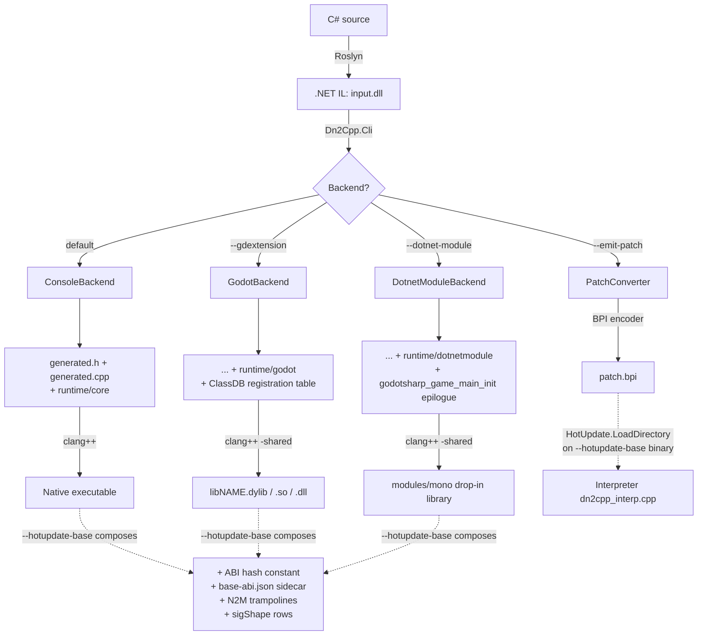

# dn2cpp

<p align="center">
  
</p>

> [!WARNING]
> **Pre-1.0.** dn2cpp is actively developed and not yet a stability
> promise for shipping products. APIs, CLI flags, generated C++, and the
> runtime ABI can change between commits without deprecation, and a
> handful of IL/BCL corners stay fenced (see Non-goals below).

**dn2cpp is an ahead-of-time compiler from .NET IL to C++, plus the C++
runtime it targets.** The core is pure .NET and knows nothing about any
game engine: it takes an IL assembly and produces a native executable —
`dotnet publish` a console app straight to a native binary, the same job
NativeAOT does, reached by a different route that goes through C++.

Two Godot backends sit on that same core. The primary one targets **Godot
.NET as it is actually used**: a stock `Godot.NET.Sdk` project — the real
`GodotSharp`, the real source generators, `res://Player.cs` attached to a
node in the scene — transpiles whole and drops into the engine's
`modules/mono` load path in place of the C# game, which is the move
IL2CPP makes on Unity's mono. The second emits a **GDExtension** library
instead, which a stock engine with no .NET support at all can load.
Either way, Godot is one of dn2cpp's outputs, not its premise.

What goes in is real .NET IL — the actual `System.Private.CoreLib`, the
real `System.Linq`, the real `System.Text.Json` through source-gen — and
what comes out runs: full IL coverage, canonically shared generics
(IL2CPP-style, on by default), real OS threads, Boehm-GC-backed
finalizers and true `WeakReference`, and reflection at IL2CPP-level
parity. The transpiler **self-hosts**: a native `dn2cpp` re-transpiles
its own IL byte-identically — a fixpoint over tens of thousands of lines
of ordinary managed C#.

dn2cpp is deeply inspired by — and has nothing but respect for — Unity's
IL2CPP. The shape of the thing is IL2CPP's idea: explicit vtables instead
of C++ `virtual`, canonically shared generic bodies, a small runtime with
the BCL supplied as transpiled IL. Bringing an equivalent capability
within reach of Godot — and of .NET at large — is the point; rivalling or
diminishing IL2CPP's achievement is not.

The same core drives five delivery targets:

- **Console** — a native executable per platform; with the `Dn2Cpp.Build`
  MSBuild package, a plain `dotnet publish` away.
- **Godot .NET (mono-module drop-in)** — substitutes for the C# game in
  Godot's `modules/mono` load path exactly where a NativeAOT export would
  sit, so the engine and its export template stay unmodified; transpiles
  the real `GodotSharp.dll` end to end. An existing `Godot.NET.Sdk`
  project needs no source changes. The interop ABI is pinned to
  `godotengine/godot a13da4feb8` (4.7.1-stable). A [forked editor][fork]
  turns it into a one-click export (`dotnet/export_backend = dn2cpp`).
- **GDExtension** — Godot 4.7 shared library, loadable by a stock engine
  with no .NET support compiled in. The C# compiles against dn2cpp's
  generated GodotSharp shim rather than the real one, so standard
  `Node`/`_Ready`/`GD.Print`/`[Export]`/`[Signal]` source transpiles
  unmodified (verified E2E in a real engine), but an existing Godot .NET
  project has to be re-targeted onto the shim.
- **Hot update (HybridCLR-style)** — build-time-baked Baked Patch Image
  (BPI) + register-based bytecode interpreter (`--hotupdate-base` +
  `--emit-patch`); patches inherit from and override AOT types without
  runtime code generation, so they work in JIT-prohibited environments
  (iOS, consoles).
- **Cross-platform** — the same core runs headless on **Windows, macOS,
  Linux, WASM (Emscripten), iOS (simulator E2E, engine-exported),
  Android (NDK)** through a shared PAL (`runtime/core/platform/`) and a
  CMake build backend.

Everything is guarded by a regression suite (`./gates/run-all-gates.sh`)
that diffs native output against real .NET.

[fork]: https://github.com/takuma-komatsu/godot-dn2cpp

## At a glance

| Delivery target | CLI flag | Load path | Verification gate | Windows | macOS | Linux | iOS | Android | WASM |
|----|----|----|----|:-:|:-:|:-:|:-:|:-:|:-:|
| Console | *(default)* | Native executable | `gates/build-and-run-sample.sh` | ✅ | ✅ | ✅ | ✅ sim | ✅ NDK build | ✅ (full GC) |
| Godot .NET (mono-module drop-in) | `--dotnet-module` | Godot `modules/mono` | `gates/build-and-run-godot-dotnet-sample.sh`, `gates/build-and-run-godot-editor-export.sh` | 🚧 | ✅ | 🚧 | ✅ sim E2E | ✅ NDK build | ✅ browser E2E |
| GDExtension | `--gdextension` | Godot loads `.dylib`/`.so`/`.dll` | `gates/build-and-run-godot-sample.sh` | ✅ | ✅ | ✅ | ✅ sim E2E | ✅ NDK build | — |
| Hot update (BPI) | `--hotupdate-base` + `--emit-patch` | `HotUpdate.LoadDirectory("*.bpi")` | `gates/build-and-run-hotupdate-subset.sh`, `gates/build-and-run-hotupdate-godot.sh` | ✅ | ✅ | ✅ | ✅ | ✅ | ✅ |
| Bindings generation | `--generate-bindings extension_api.json` | Build step | (runs inside every Godot-lane gate) | ✅ | ✅ | ✅ | — | — | — |

Legend: ✅ verified in a gate · 🚧 not yet verified (see notes) · — not applicable.

**Note (Godot .NET drop-in).** Its E2E gates need a scons-built
mono-enabled Godot editor + export template
(`gates/setup-godot-dotnet.sh`, `gates/setup-godot-fork.sh`), which is
macOS-only tooling today — on any other host they opt out via `gate_skip`
rather than genuinely running, which is what the two 🚧 cells reflect.
The Android cell is the NDK cross-build of the same drop-in, and the
forked editor's Android export runs an unmodified C# demo on a physical
device against the *official* mono export template. The WASM cell is a
full browser export — Godot 4 supports C# on the Web nowhere else.
Separately, the emitted library indexes the engine's interop table **by
hard-coded position with no runtime handshake**, so it is 4.7.1-stable or
nothing: a different engine build mis-dispatches silently instead of
failing.

**Note (Linux).** The full suite runs green on Linux, the Godot desktop
GDExtension lane included against a real engine; every skip is
cross-toolchain (Xcode, Android NDK, Emscripten) or the macOS-only fork
tooling above, not a Linux support gap.

## Quick start

### Prerequisites

- .NET SDK **net10.0** (`dotnet --list-sdks` should list a `10.0.x`)
- `clang++` (C++17) — or real MSVC `cl.exe` on Windows
- `cmake` ≥ **3.20** + `ninja`
- Godot **4.7** on `PATH` (or `GODOT=/path/to/godot`) — required only for
  the Godot-lane gates
- `extension_api.json` at the repository root — generate on a fresh clone
  with `godot --headless --dump-extension-api`

macOS (Apple silicon or x86_64) is the Tier-1 host; Windows (real MSVC
`cl.exe`) and Linux both run the suite green too.

These are the prerequisites of **this repository** and of the dotnet tool below,
both of which build through the host's own tools. They are not the prerequisites
of the distributable editor, which carries a pinned cmake and ninja of its own
(`gates/expected/buildtools-pin.txt`) and asks its user for neither. The fork
editor-export gates are the one exception — they assert the export ran through
that pinned pair, so unpack it (`gates/setup-buildtools.sh`) before
`gates/setup-godot-fork.sh` packages a bundle.

### Install as a dotnet tool (no clone)

The CLI ships as a NuGet **dotnet tool** that carries the C++ runtime and the
vendored third-party sources inside the package — transpile and native-build
without a repository checkout (only `clang++`/`cmake`/`ninja` needed):

```bash
dotnet tool install -g dn2cpp

dn2cpp MyApp.dll -o out --auto-ref     # IL → C++ (BCL from the live framework)
cmake -S "$(dn2cpp --print-runtime-dir)" -B out/build -G Ninja \
      -DDN2CPP_APP_DIR="$PWD/out" -DDN2CPP_APP_NAME=MyApp
cmake --build out/build
./out/build/MyApp
```

`--auto-ref` with no `-r` defaults the CoreLib to the running shared
framework's copy; `--print-runtime-dir` answers with the packaged `runtime/`
(the sibling `third_party/` tree comes with it). The Godot lanes work from the
tool too.

For one-command console publishing there is also **`Dn2Cpp.Build`**, a
targets-only MSBuild package (`src/Dn2Cpp.Build/`): add the PackageReference
and `dotnet publish` runs the installed tool + CMake and drops the native
binary into the publish dir:

```bash
dotnet add package Dn2Cpp.Build
dotnet publish -c Release          # → bin/Release/net10.0/publish/MyApp (native)
```

Both packages are proven end to end by `dist/nuget-smoke-test.sh` (pack →
local-feed install → transpile → CMake build → run → diff, then the same
through a `Dn2Cpp.Build` consumer).

### 60-second smoke test

```bash
git clone https://github.com/<owner>/dn2cpp.git
cd dn2cpp
godot --headless --dump-extension-api     # only on a fresh clone
./gates/build-and-run-sample.sh           # console: C# → IL → C++ → native → run
```

The script compiles `samples/dotnet/HelloWorld/`, transpiles it against
the tree-shaken real CoreLib, links it against the mini-runtime, and
diffs the output against `dotnet run` byte-for-byte.

### Three-lane sanity check, then the full gate

```bash
./gates/build-and-run-sample.sh          # console
./gates/build-and-run-multiassembly.sh   # multi-assembly -r
./gates/build-and-run-godot-sample.sh    # Godot 4.7 GDExtension (real engine)

./gates/run-all-gates.sh                 # the whole suite in parallel
SKIP_GODOT=1 ./gates/run-all-gates.sh    # fast smoke without Godot
JOBS=8 ./gates/run-all-gates.sh          # cap parallelism
```

Gates whose toolchain is missing (Godot, `em++`, Xcode, NDK) skip, and are
reported separately from the passes — a skip is never counted as a pass. A
failing gate is listed in `$LOGDIR/_failures.txt` with its log.

## Backends

### Console

- **What.** Emits `generated.{h,cpp[,cpp,...]}` (bodies past ~1MB split
  for parallel compile) plus links the `runtime/core/` TUs, producing a
  native executable.
- **Invoke.** `dotnet run --project src/Dn2Cpp.Cli -- <input.dll> -o <outdir>`
  (add `-r <ref.dll>` for extra assemblies, `--auto-ref` to pull the
  shared-framework closure).
- **Gate.** `gates/build-and-run-sample.sh`,
  `gates/build-and-run-multiassembly.sh`. Output is diffed byte-for-byte
  against `dotnet run`.
- **GC mode.** Classic stop-the-world by default; override with
  `DN2CPP_GC_INCREMENTAL=1` / `DN2CPP_GC_TIME_LIMIT_MS`.

### Godot .NET — mono-module drop-in

The lane for an existing Godot C# game. **No GDExtension involvement, and
no changes to the engine or its export template.**

- **What.** A dn2cpp-built shared library substitutes for the C# game in
  Godot's `modules/mono` load path — it lands where a NativeAOT export
  would, so the engine picks it up through the `try_load_native_aot_library`
  path it already has. The real `GodotSharp.dll` (from a pinned engine
  clone's `modules/mono/glue` + Godot.NET.Sdk source generators) is
  transpiled BCL-as-IL; all engine access goes through the `godotsharp_*`
  function-pointer array via `calli` and the `ManagedCallbacks` table. No
  `extension_api.json` intrinsics are needed. Script semantics survive:
  `res://Player.cs` attached to a node resolves through the managed script
  bridge, so existing scenes bind as they are.
- **Invoke.** `dotnet run --project src/Dn2Cpp.Cli -- <input.dll> --dotnet-module -o <outdir>`.
  Runtime backend: `runtime/dotnetmodule/`, CMake `DN2CPP_DOTNET_MODULE`.
- **Editor integration.** A [forked Godot editor][fork] adds
  `dotnet/export_backend = dn2cpp` as an export option: one
  `--export-release` publishes the game IL, transpiles it, builds the C++
  and stages the library — no manual step. The fork's changes live in
  `GodotTools` (C#) and `build_assemblies.py`, never in the engine runtime
  or the ABI surfaces. Design, fork strategy, packaging layout and re-pin
  procedure: `docs/EDITOR-EXPORT-DESIGN.md`. The fork's Releases carry a
  built macOS editor `.app` and a Windows `x86_64` editor, plus the two
  export templates upstream cannot supply — the Web one, and a macOS
  `arm64` one, since the backend never cross-compiles and upstream's
  macOS archive is universal-only. The `.app` is ad-hoc signed and not
  notarized, so clear its quarantine attribute
  (`xattr -dr com.apple.quarantine`) before the first launch; the Windows
  editor is unsigned, and building a **Windows game** from it needs the
  Visual Studio C++ workload *installed* — but no particular shell: the
  editor locates MSVC itself and overlays it onto the build children, so
  an Explorer launch is enough. Web and Android need neither, each
  bringing its own compiler.
- **ABI pin — read this before shipping.** `godotengine/godot a13da4feb8`
  (4.7.1-stable). The emitted library indexes the interop table **by
  hard-coded position, with no runtime handshake**, so a mismatched engine
  build mis-dispatches silently rather than failing loudly. The gates
  carry a SHA-256 tripwire over the clone HEAD + the interop array block +
  `ManagedCallbacks.cs`, frozen in
  `gates/expected/godot-dotnet-abi.sha256`; re-pin = re-run
  `gates/setup-godot-dotnet.sh` and re-freeze the fingerprint.
- **Gate.** `gates/build-and-run-godot-dotnet-sample.sh` — verified E2E in
  the real engine: all virtuals, input, `[Export]`, `[Signal]`,
  `ToSignal`, `RefCounted` lifetime stress, and **async interop** (`Task`
  continuations marshal back to the main thread via a non-blocking
  run-queue pump driven by the host frame callback).
  `gates/build-and-run-godot-editor-export.sh` and its `-ios` / `-web`
  siblings drive the whole fork pipeline from one headless export — to a
  playable macOS `.app`, to an xcframework booted on an iPhone simulator,
  and to a wasm side module running in a real browser. Godot's upstream
  mono `squash_the_creeps` demo goes through this lane unmodified.
- **Carve-outs.** Editor F5 (export-run only; TOOLS builds use the
  hostfxr 6-argument path), editor hot-reload state (`Callable` /
  delegate serialization reports "unserializable", which the engine
  already handles), GDScript→C# `CallStatic`, `Delegate.Method` (returns
  null), async void signal handlers, managed stack traces (an exception's
  `GD.PushError` text is real, but its file is null and line 0), and
  `Variant` → `GodotObject[]` conversion.

### GDExtension

The lane for a stock engine. Runs on a Godot build with no .NET support
compiled in at all — the price is that the C# targets dn2cpp's generated
GodotSharp shim rather than the real one, so an existing Godot .NET
project has to be re-targeted, and its classes register in ClassDB as
GDExtension classes rather than as C# scripts.

- **What.** Emits `libNAME.dylib`/`.so`/`.dll` that Godot loads at
  runtime, with transpiled C# registered in ClassDB. Public C# static and
  instance methods and properties are callable from GDScript;
  **`Godot.Node`-derived C# classes are placeable in scenes** and receive
  engine virtual callbacks (`_Ready`, `_Process`, `_Notification`, and
  every `_*` whose signature the codec models — reverse-dispatch
  trampolines are generated per class from the API dump, not just the
  lifecycle/input set).
- **Invoke.** `dotnet run --project src/Dn2Cpp.Cli -- <input.dll> --gdextension -o <outdir>`,
  then compile as a shared library. Ship `<name>.gdextension` next to it.
- **Gate.** `gates/build-and-run-godot-sample.sh` (real headless Godot
  4.7), `gates/build-and-run-sdk-sample.sh` (a Godot.NET.Sdk API-surface
  project).
- **`Godot.NET.Sdk` source compatibility.** Standard-form C# using
  `Node2D`/`GD.Print`/`_Ready`/`[Export]`/`[Signal]`/`[Tool]` compiles
  against `src/GodotSharpShim/` (generated from `extension_api.json`) and
  transpiles unmodified — the *source* is portable, the project reference
  is not. All builtin value types round-trip; `Callable` (including
  delegate-backed), `Signal`, engine-backed
  `Godot.Collections.Array`/`Dictionary`, and typed arrays all cross the
  boundary.
- **`RefCounted`.** A strong/weak resurrection toggle keeps a C#-`new`
  registered `RefCounted` instance's state and virtual overrides alive
  across a hand-off to the engine (stored in an
  `Array`/`Dictionary`/property/scene/…) even after every C# reference is
  dropped; an overflow of the anchored-shim cap falls back to the plain
  detach path with a one-shot `stderr` warning.
- **GC mode.** Incremental Boehm (bounded frame pauses) by default;
  override with `DN2CPP_GC_INCREMENTAL` / `DN2CPP_GC_TIME_LIMIT_MS`.

### Hot update — Baked Patch Image (BPI)

- **What.** A HybridCLR-style AOT + interpreter hybrid. `--emit-patch`
  bakes a patch assembly at build time into a **BPI** — a compact
  register-based bytecode (v2, default) or the v1 stack machine
  (`--patch-stackcode`) — that a base image built with `--hotupdate-base`
  loads at runtime and executes via `runtime/core/dn2cpp_interp.cpp`.
  Patches inherit from and override AOT types (dynamic vtable patch, N2M
  trampolines, patch-derived `Node` instances) **without any runtime code
  generation** — so it works on iOS and consoles.
- **Invoke** (base): `dn2cpp <input.dll> --hotupdate-base [--hotupdate-refs <roots.txt>]`.
  **Invoke** (patch): `dn2cpp --emit-patch <patch.dll> --base-abi <base-abi.json> [--patch-version N]`.
- **Deploy.** `Dn2Cpp.Runtime.HotUpdate.LoadDirectory("<dir>")` applies
  BPIs in `(patchVersion, filename)` order; header-stale BPIs are logged
  to stderr and skipped. Base-ABI drift is detected mechanically via
  `baseImageAbiHash` (FNV-1a over the symbolic contract in
  `docs/BPI-FORMAT.md`), so a stale patch is a loud diagnostic at load
  rather than a mis-bind.
- **Gate.** `gates/build-and-run-hotupdate-subset.sh` (console; both
  bytecode formats), `gates/build-and-run-hotupdate-godot.sh` (in-engine
  deployment, engine-driven `_Process` reaches interpreted overrides),
  `gates/measure-interp.sh` (register vs stack A/B).
- **Isolation.** Everything sits behind `--hotupdate-base` /
  `--emit-patch` / `runtime/core/dn2cpp_interp.cpp` (unlinked unless
  called). Normal builds are byte-identical.
- **Known limits.** Generic instantiations absent from the AOT image
  throw `NotSupportedException` unless pre-referenced (`hotupdate-refs.txt`,
  HybridCLR's `AOTGenericReferences` equivalent). Patch generic
  types/methods, filter clauses inside a patch, and value-type
  `Synchronized` methods stay fenced (loud bake-time rejection).

### Cross-platform (Windows / macOS / Linux / iOS / Android / WASM)

The core is platform-agnostic. Divergence is absorbed by a **Platform
Abstraction Layer** (`runtime/core/platform/`, `dn2cpp_pal_*` seams:
file-system metadata and mutation, the environment block, the
ANSI/system-code-page transforms, the executable path, the process-wide
memory barrier, local time, malloc-usable-size, and the native backtrace)
with per-platform implementations (`posix/`, `wasm/`, `windows/`, plus a
complete portable-C++17 `reference/` implementation of the whole seam).
**CMake** (`runtime/CMakeLists.txt`, Ninja) is the sole build backend; the
gate scripts are thin wrappers. **`docs/PORTING.md` is the guide for
bringing dn2cpp up on a new target** — the seam inventory, the CMake
edits, the gate/skip protocol, and the recorded porting hazards.

| Platform | Console | GDExtension | Notes | Gate |
|----|:-:|:-:|----|----|
| **Windows** | ✅ | ✅ | Win32 I/O, `_msize`, `localtime_s`, `\` and drive-letter rooted paths, real MSVC `cl.exe` (clang-cl not pursued) | full suite via `CMAKE_CXX_COMPILER=cl ./gates/run-all-gates.sh` |
| **macOS** (Tier-1) | ✅ | ✅ | Full Boehm GC | every gate |
| **Linux** | ✅ | ✅ | Shares the POSIX PAL with macOS; OpenSSL `CryptoNative_Evp*` crypto-digest PAL, membarrier, GC thread-deregistration. Full suite green, Godot desktop GDExtension included | full suite via `./gates/run-all-gates.sh` |
| **iOS simulator** | ✅ | ✅ E2E | Full Boehm GC; `GD.Print` goes to the platform logger — use `Console` for E2E markers | `gates/build-and-run-ios-sim-console.sh`, `gates/build-and-run-godot-ios-sim.sh` |
| **iOS device** | ⏳ | ⏳ | Provisioning required; the build path is verified headlessly | `gates/build-and-run-godot-ios-export.sh` |
| **Android** (NDK) | ✅ build | ✅ `.so` build | `arm64-v8a`, API 24; the `--dotnet-module` drop-in cross-builds too. Real-device runs confirmed on a Pixel 7a, including an unmodified C# demo exported by the forked editor onto the official mono template | `gates/build-and-run-android-gdext.sh`, `gates/build-and-run-godot-dotnet-lib.sh` |
| **WASM** (Emscripten) | ✅ | — | Full Boehm GC (Binaryen SpillPointers + a `dn2cpp_roots` section), MEMFS, single-threaded; P/Invoke against emcc-built static archives; the Godot drop-in exports to a real browser | `gates/build-and-run-wasm-console.sh`, `gates/build-and-run-pinvoke-wasm.sh`, `gates/build-and-run-godot-editor-export-web.sh` |

## Architecture

The core (transpiler + runtime) knows nothing about Godot, dotnet-module
hosting, or hot update. Each delivery target is a layer that plugs in
through two hooks: `IEmitBackend` (tail-output) and `ICallIntrinsics`
(call-intrinsic).

| Layer | C# side | Native side |
|----|----|----|
| **Core (pure .NET)** | `src/Dn2Cpp.Transpiler/` — `Compilation` / `MethodCompiler` / `CppEmitter` / `PatchConverter`; `ConsoleBackend`. `src/Dn2Cpp.Runtime/` — always-referenced support assembly (`SZArrayEnumerable<T>`, `HotUpdate`, `NativeImplementation`) | `runtime/core/` — object model, strings, arrays, EH, GC integration; `runtime/core/intrinsics/`; `runtime/core/platform/` (PAL); optional SIMD (`runtime/core/dn2cpp_vectors.h`, `runtime/core/dn2cpp_vectors_hwy.h`) |
| **Godot .NET drop-in** | `src/Dn2Cpp.DotnetModule/` — `DotnetModuleBackend` (emits `godotsharp_game_main_init`) | `runtime/dotnetmodule/` |
| **GDExtension layer** | `src/Dn2Cpp.Godot/` — `GodotBackend`, `GodotCallIntrinsics`, `BindingGenerator` | `runtime/godot/` — table-driven bridge |
| **Hot update layer** | `PatchConverter` in `src/Dn2Cpp.Transpiler/` + `--hotupdate-base` output extras; `Dn2Cpp.Runtime.HotUpdate` public API | `runtime/core/dn2cpp_interp.cpp` — BPI loader/binder + register/stack interpreter, N2M trampolines |
| **CLI (composition root)** | `src/Dn2Cpp.Cli/` (output assembly `dn2cpp`) — arg parsing, backend selection; `src/Dn2Cpp.Cli.Console/` — Godot-free self-host trimmed CLI | — |
| **Reference-assembly shim** | `src/GodotSharpShim/` (builtin value types + `GD`/`Mathf`, generated from `extension_api.json`) | — |
| **Managed-swap backends** | `internal/DnZlib/` (pure-C# zlib), `internal/DnBrotli/` (pure-C# brotli), `internal/DnHttp/` (managed HTTP transport). All three are **conditional default references** — they ship beside the CLI and are injected only when the BCL assembly each one serves is in the load set; `-r` overrides, `--no-default-ref <Name>` declines | — |

The CLI selects the backend by flag: default → `ConsoleBackend`;
`--gdextension` → `GodotBackend`; `--dotnet-module` →
`DotnetModuleBackend`. `--hotupdate-base` composes with any of them (adds
an ABI-hash constant, a `base-abi.json` sidecar, N2M trampolines, and
`sigShape` rows); `--emit-patch <patch.dll>` short-circuits to
`PatchConverter.Run` (no C++ emission).



### Contract seams

- `IEmitBackend` (`src/Dn2Cpp.Transpiler/IEmitBackend.cs`) —
  `RuntimeHeader`, `EmitEpilogue(...)`, `ShouldSkipMethodBodies(ClassInfo)`,
  `WantsSyntheticBody`, `HasPlaceholderBody`.
- `ICallIntrinsics` (`src/Dn2Cpp.Transpiler/ICallIntrinsics.cs`) —
  `TryEmitCall(mc, callee, isCallvirt)`.

`docs/ARCHITECTURE.md` covers the internals and the "how to add X"
recipes (a new IL opcode, a BCL intrinsic, an engine call, a new target
backend).

## Feature coverage

### Language & IL

Full ECMA-335 IL coverage. What that means concretely:

- **Types and dispatch** — classes, inheritance, static constructors with
  .NET first-use semantics, value types, enums, `record` classes (`with`,
  value equality), value tuples. **Virtual dispatch through explicit
  vtables** (IL2CPP-style, no C++ `virtual`) off the `Dn2CppTypeInfo` at
  the head of every object; interfaces use IL2CPP-style dispatch maps.
- **Memory and values** — arrays with bounds checks, multi-dimensional
  `T[,]`, element-size-generic backing so `T[]` works for any element
  type; **arrays as managed interfaces** (`T[]` as `IEnumerable<T>` /
  `IList<T>` / … via a per-`T` `SZArrayEnumerable<T>` wrapper);
  box/unbox and `is`/`as`/cast checks; `ref`/`out`/`in`; `constrained.`
  calls; checked arithmetic; `cpblk`/`initblk`; `typeof`/`ldtoken`.
- **UTF-16 strings** with .NET `System.String` semantics; UTF-8
  conversion happens only at the console / Godot / P/Invoke boundary.
- **Exception handling** — structural EH-region reconstruction into C++
  try/catch: multiple catch clauses, try/catch/finally, fault handlers,
  `catch … when` filters, multi-level finally chains, nested EH.
- **Delegates / lambdas** — `ldftn`/`ldvirtftn`, Roslyn display classes
  and cached lambdas, multicast `+=`/`-=`, static function pointers
  (`calli`/`delegate*<...>`).
- **Generics — canonical shared bodies (IL2CPP-style, on by default).**
  Instantiations whose C++ layout coincides collapse to placeholders:
  enum and sub-8-byte integer arguments to width-preserving placeholders,
  every reference argument to one `CnRef`. So `Dictionary<int,string>`
  and `Dictionary<SomeEnum,object>` share every non-ctor body, and
  generic *method* instantiations share too. Instantiation-dependent
  values (typeof, statics, `newarr`, `Comparer<T>.Default`) come from a
  per-instantiation RGCTX table, with a per-method monomorphic fallback
  for bodies that would bake exact identity. `--no-shared-generics`
  restores full monomorphization byte-identically.
- **`MethodImplOptions` honored** — `Synchronized` (RAII monitor guard,
  static sharing the monitor with `lock(typeof(X))`),
  `AggressiveInlining`, `NoInlining`.
- **Whole-program shaping** — reachability tree-shake from roots, so
  large assemblies import without transpiling unreached or unsupported
  code; multi-assembly input (`-r`) resolving TypeRef/MemberRef across
  modules; generated C++ split into translation units for parallel
  compilation.

### BCL (System.*) over the real CoreLib

The real `System.Private.CoreLib.dll` goes in via `-r` (`--auto-ref`
pulls the shared-framework closure). The full CoreLib type graph loads,
tree-shaken to reachable methods, with real BCL IL bodies transpiled;
`Console`/`Math`/`String` prefer intrinsics.

| Area | State |
|---|---|
| Collections & strings | Real CoreLib `List<T>`/`Dictionary<K,V>`/`HashSet<T>`/`SortedDictionary`/`SortedSet`, `StringBuilder`, interpolated strings, the main `String` API, `Comparer<T>`/`EqualityComparer<T>.Default` |
| LINQ | Real `System.Linq.dll` transpiled as-is (SIMD paths folded to scalar) — no shim |
| JSON | Real `System.Text.Json` through the source-gen path (`[JsonSerializable]` + `JsonSerializerContext`); the generated `JsonTypeInfo<T>` and converters are real STJ IL |
| Iterators & async | Real CoreLib state machines; cooperative scheduler with real suspension, `Task.Yield`/`WhenAll`, the `ConfiguredValueTaskAwaitable(<T>)` awaiter family, `async IAsyncEnumerable<T>` |
| `decimal` | Intrinsic 96-bit value type — exact base-10 arithmetic (round-half-away), comparisons, conversions, `ToString`, the statics (`Round`/`Truncate`/`Floor`/`Ceiling`/`Parse`, …), LINQ `Sum`/`Average`, boxed virtuals |
| Culture & formatting | Culture-aware numeric/currency/percent/exponent formatting and `Parse`/`TryParse`, float shortest-round-trip, custom numeric formats; `CurrentCulture` follows the host locale through a PAL seam with no ICU dependency |
| Regex | Real `System.Text.RegularExpressions.dll`, both engines (backtracking interpreter and `NonBacktracking` symbolic DFA) |
| Compression | Full `System.IO.Compression` public surface — `DeflateStream`/`GZipStream`/`ZLibStream`, `BrotliStream`/`BrotliEncoder`/`BrotliDecoder`, `ZipArchive`/`ZipArchiveEntry`, `ZipFile`, and the net10 Zip async APIs |
| HTTP / HTTPS | `new HttpClient()` runs natively over vendored libcurl on vendored Mbed TLS, on by default; `https://` verifies against an embedded Mozilla CA bundle and nothing disables verification. HTTP/2 rides the same transport, and the real `Grpc.Net.Client` runs on top of it (unary and all three streaming shapes) |
| File I/O | Real `System.IO.File`/`FileStream` through the CoreLib's `libSystem.Native` P/Invoke layer against a self-implemented `SystemNative_*` PAL, directory enumeration included |
| Low-level interop | `Unsafe.*` (incl. `Unbox<T>`), `NativeMemory`, the `Marshal` heap/struct/string family, `Marshal.GetFunctionPointerForDelegate`/`GetDelegateForFunctionPointer`, `MemoryMarshal` span shaping, custom `MemoryManager<T>`-backed `Memory<T>` |

**Managed native-implementation substitution.** A
`[Dn2Cpp.Runtime.NativeImplementation(module, entryPoint)]` static method
in any referenced assembly replaces calls to the matching bodyless
`[DllImport]` at transpile time — the call site lowers to a direct managed
call and the native symbol is never linked. `internal/DnZlib/` and
`internal/DnBrotli/` use it to back all of `System.IO.Compression` with
pure C#, and because both are conditional default references, that is what
happens by default. The vendored native path is still there
(`runtime/core/intrinsics/dn2cpp_zlib_native.cpp` over `third_party/zlib/`,
the vendored brotli's own exports) and `--no-default-ref DnZlib` /
`--no-default-ref DnBrotli` is the way back to it.

### Runtime services

- **Boehm-Demers-Weiser GC** (`third_party/bdwgc/`, compiled with the
  runtime, thread-aware). Reference-free arrays allocate through the
  unscanned allocator; `ArrayPool<T>.Shared` is a real size-bucketed
  pool. Modes: classic stop-the-world (console default) and Boehm
  incremental (Godot default, bounded frame pauses), with
  `DN2CPP_GC_INCREMENTAL` / `DN2CPP_GC_TIME_LIMIT_MS` / `DN2CPP_GC_STATS`
  overrides; `DN2CPP_NO_GC=1` opts out to a calloc fallback.
- **Finalizers** — `Finalize` overrides detected at build time and
  registered at allocation *before* the ctor runs, matching .NET's
  partially-constructed-object semantics; a dedicated finalizer thread
  drains the queue. `GC.SuppressFinalize`/`ReRegisterForFinalize` do real
  (de)registration.
- **True `WeakReference`/`WeakReference<T>`** on Boehm disappearing links
  (short) and long links (`trackResurrection: true`), matching .NET
  resurrection semantics; **`GCHandle`** with all four `GCHandleType`
  values on a shared-cell model.
- **Real OS threads** — `Thread`, `Task.Run`, `ThreadPool`,
  `Parallel.For`/`ForEach`/`Invoke` over `std::thread` and a real worker
  pool. **Real synchronization** — `Interlocked` → `__atomic_*`;
  `Monitor`/`lock` → per-object recursive mutexes; `Monitor.Wait`/`Pulse`,
  `SemaphoreSlim`, the event and countdown primitives,
  `ReaderWriterLockSlim`, `BlockingCollection<T>`, real `Timer`,
  `ThreadLocal<T>`/`[ThreadStatic]` → `thread_local`,
  `volatile`/`MemoryBarrier` → fences.
- **Reflection at Unity-IL2CPP parity** — the member-metadata APIs,
  `MethodInfo.Invoke`, `FieldInfo`/`PropertyInfo` get/set,
  `GetCustomAttributes`, `Type.GetType(string)`,
  `Activator.CreateInstance`, `MakeGenericType` over AOT-instantiated
  types. `Type` objects are interned one per type-info handle, so
  `typeof(X)` and `GetType()` are reference-identical; retrieval is
  lock-free for statically-emitted types. `--trim-reflection` drops the
  member tables of types the program cannot plausibly reflect over, and a
  stripped type **throws** rather than answering empty.
- **P/Invoke** — `DllImport` end to end: `string[]` write-back, delegates
  as native function pointers, non-blittable structs, blittable
  `[MarshalAs(ByValArray)]`. The supported marshalling surface is
  enumerated one feature per row in `docs/PINVOKE-MARSHALLING.md`.
- **Stack traces** — captured at throw and rendered against the
  reflection method tables; the opt-in `--shadow-stack` adds
  emitter-baked frame names that survive `-O2` inlining and exist on
  WASM, and makes the current-stack APIs real.

### Godot integration

- **Godot .NET drop-in** — `--dotnet-module` substitutes for the C# game
  in Godot's `modules/mono` load path: the real `GodotSharp.dll` is
  transpiled, existing `Godot.NET.Sdk` projects and their `res://*.cs`
  scene bindings work unchanged, and the engine and export template are
  untouched. A [forked editor][fork] adds one-click export, including to
  the Web — where Godot 4 supports C# nowhere else.
- **GDExtension bridge** — `--gdextension` emits a registration table and
  the table-driven bridge in `runtime/godot/` registers C#-derived
  classes with ClassDB; public statics, instance methods and properties
  are callable from GDScript via both Variant call and ptrcall.
- **Engine calls from C#** go through a registry of method binds built
  from `extension_api.json` and a generic ptrcall path. All builtin value
  types round-trip; the shim lane reaches essentially the whole
  non-vararg instance-method surface plus the static and virtual
  populations — enums and bitfields, math PODs + RID, packed arrays ↔
  managed arrays, a tagged `Variant`, engine-backed
  `Godot.Collections.Array`/`Dictionary` and typed arrays, `Callable`
  (including delegate-backed) and `Signal`, varargs and statics.
- **Scene-tree integration** — `Godot.Node`-derived C# classes are
  placeable in scenes and every `_*` virtual whose signature the codec
  models is overridable (reverse-dispatch trampolines generated per
  class), not just the lifecycle/input set. **`Godot.RefCounted`**
  lifetimes, including C#-`new`-created ones, survive engine hand-off.
- **Bindings generation** — `dn2cpp --generate-bindings extension_api.json`
  regenerates `src/GodotSharpShim/` and the transpiler's engine-call map
  from the same source of truth, implicitly inside every Godot-lane gate.

### Tooling

- **Self-hosting.** Both the Godot-free `src/Dn2Cpp.Cli.Console/` and the
  full CLI reach a **fixpoint**: the natively built dn2cpp re-transpiles
  its own source byte-identically (`gates/selfhost-emit.sh`,
  `gates/selfhost-emit-console.sh`) — a whole-program stress test of the
  core at real-application scale, with no .NET runtime dependency.
- **Gap-inventory measurement** (`--measure`) records a body's compile
  failure as a gap row instead of aborting the run, so it can drain a
  whole real-world assembly and report what would not emit.
- **Bounded resource use.** Monomorphization is capped on nesting depth
  and total count and fails loudly naming what drove it; emission streams
  its translation units to disk rather than holding the program's text;
  and a specialization, a method signature or a field type nothing asks
  about is never decoded. `--max-heap-mb` is an opt-in managed-heap
  ceiling that fails naming the phase.
- **Highway SIMD backend by default** (CMake `DN2CPP_USE_HIGHWAY`);
  `-DDN2CPP_USE_HIGHWAY=OFF` opts back into the scalar emulation, which
  keeps the SIMD-fold behavior byte-identically.

## Repository layout

| Path | Contents |
|------|----------|
| `src/Dn2Cpp.Transpiler/` | Core: `Compilation` / `MethodCompiler` / `CppEmitter` / `PatchConverter`; `ConsoleBackend` |
| `src/Dn2Cpp.DotnetModule/`, `src/Dn2Cpp.Godot/` | The two Godot backends (mono-module drop-in; GDExtension + engine-call intrinsics + `BindingGenerator`) |
| `src/Dn2Cpp.Cli/`, `src/Dn2Cpp.Cli.Console/` | CLI (output assembly `dn2cpp`) and the self-host trimmed CLI |
| `src/Dn2Cpp.Runtime/` | Always-referenced support: `SZArrayEnumerable<T>`, `HotUpdate`, the `NativeImplementation` attribute |
| `src/Dn2Cpp.Build/` | Targets-only MSBuild package — `dotnet publish` → native binary |
| `src/GodotSharpShim/` | "Fake GodotSharp" shim, generated from `extension_api.json` |
| `runtime/core/` | Object model, strings, arrays, exceptions, GC integration; `intrinsics/` (native intrinsic TUs); `platform/` (PAL: `posix/`, `wasm/`, `windows/`, `reference/`); `dn2cpp_interp.cpp` (hot-update loader + interpreter) |
| `runtime/godot/`, `runtime/dotnetmodule/` | Table-driven GDExtension bridge; `modules/mono` drop-in glue |
| `runtime/CMakeLists.txt` | Sole native build backend (Ninja); gates thin-wrap it |
| `internal/DnZlib/`, `internal/DnBrotli/`, `internal/DnHttp/` | Managed-swap libraries shipped as conditional default references |
| `third_party/` | Vendored: `bdwgc/`, `zlib/`, `brotli/`, `highway/`, `gdextension_interface.h` (see License) |
| `samples/dotnet/` | Themed feature buckets — one `*.cs` per feature, driven by a themed gate |
| `samples/godot/`, `samples/godot-dotnet/`, `samples/native/` | GDExtension + Godot.NET.Sdk + hot-update projects; drop-in and editor-export projects; a small C library for P/Invoke testing |
| `gates/` | The regression suite (`build-and-run-*.sh`), `run-all-gates.sh` (parallel runner), `pre-merge.sh` (the merge gate), `_common.sh` (shared helpers) |
| `docs/` | `ARCHITECTURE.md` (internals), `STATUS.md` (open backlog), `BPI-FORMAT.md` (hot-update binary spec), `EDITOR-EXPORT-DESIGN.md`, `PORTING.md`, `PINVOKE-MARSHALLING.md` |

## Design principles

- **IL2CPP-style "explicit vtable + C-style functions".** No C++
  `virtual`; dispatch goes through the vtable pointer in the object
  header. Generated code stays predictable, which eases GC / reflection /
  metadata integration.
- **The evaluation stack is modeled as single-assignment temporaries**,
  spilled to per-depth normalized variables at basic-block boundaries.
- **Deterministic generation** — the same input yields byte-identical
  output. Nothing in the environment may change what a successful
  transpile emits, which is what makes the self-host fixpoint checkable.
- **The runtime is a minimal object model + strings + arrays;** BCL
  semantics come from transpiling the real CoreLib. Intrinsics are a
  targeted optimization surface, not a semantics oracle.
- **Strings are UTF-16**; UTF-8 conversion happens only at the console /
  Godot / P/Invoke boundary.
- **A limit refuses out loud.** An unsupported shape is a transpile-time
  error or a catchable exception naming the type and the remedy — never a
  silently wrong answer.

## Verification

The regression gate is the `gates/build-and-run-*.sh` suite run in
parallel (`./gates/run-all-gates.sh`); each script transpiles a themed
multi-section program against the tree-shaken real CoreLib and **diffs
native output against real .NET** (`dotnet` as the oracle), falling back
to frozen snapshots only where divergence is intentional. Gates cache
their green results keyed on the transpile output plus every other input,
so a rerun after a localized fix takes minutes.

`gates/pre-merge.sh` is the merge gate: it runs the Release suite and then
the Debug suite, each under `DN2CPP_REQUIRE_ALL=1 DN2CPP_GATE_CACHE=0`, so
every gate genuinely runs and asserts. Two harnesses sit beside the suite:
`gates/verify-culture-invariance.sh` (no bucket's green may be a fact
about the developer's locale) and `gates/verify-locks.sh` (the advisory
locks that serialize the machine-wide engine and simulator). `AGENTS.md`
is the authoritative contract for all of it.

## Non-goals & known issues

### Permanent non-goals

Boundaries dn2cpp shares with the IL2CPP family, plus a few forced by the
AOT model itself. These are settled, not deferred — each line says why, so
it does not come back as a ticket.

- **`System.Reflection.Emit` / runtime code generation / `dynamic` / DLR /
  expression tree `Compile`.** There is no JIT to emit into. Interpreting
  BPI bytecode does *not* fall under this — the interpreter never emits
  native code.
- **`MakeGenericType`/`MakeGenericMethod` over instantiations absent from
  the AOT image.** The instantiation does not exist in the binary and
  cannot be created; the call throws a catchable
  `PlatformNotSupportedException`. `System.Text.Json` avoids the boundary
  through source-gen; reflection-based `Deserialize<T>` stays carved out.
- **`__arglist` / `TypedReference`**, and varargs or HasThis function-pointer
  signatures. IL2CPP does not support them either.
- **Real SIMD code generation.** The transpiler never emits hardware
  intrinsics; portable-SIMD operations are backed by the Highway backend
  (`DN2CPP_USE_HIGHWAY`, default on, single static ISA), with the scalar
  emulation as the byte-identical opt-out.
- **`res://` / `user://` translation inside `System.IO` (Godot lane).**
  Convert first with `ProjectSettings.GlobalizePath(...)`, or take the
  writable root from `OS.GetUserDataDir()`. A transparent translation is
  not a missing feature but a trap: in an exported game `res://` lives
  inside the PCK where `open(2)` cannot reach it, so it would work in the
  editor and break in the shipped game.
- **COM interop / `BStr` / `SafeArray`** — they depend on the COM/OLE
  runtime and are not portably implementable. `ByValArray` (blittable
  elements) and `FunctionPtr` synchronous callbacks *are* implemented;
  `ByValTStr`, `ByValArray` over non-blittable elements and asynchronous
  callbacks are not, and a `[MarshalAs]` the struct marshaller does not
  implement **refuses the crossing at transpile time**, naming the field.
- **Windows 32-bit P/Invoke ABI details** (stdcall decoration, 32-bit
  layout). dn2cpp is 64-bit-only.
- **Named/historical time zones, per-culture *date* formatting, and
  localized culture/time-zone names.** The real IL depends on ICU + TZif.
  Culture-aware **numeric** formatting is fully supported and follows the
  host locale; the name data (`DisplayName`, `TimeZoneInfo`'s names) stays
  constant, because faithful data there is not one table but cultures × UI
  languages — a partial one would answer right in English and silently
  wrong in German.
- **String comparison / collation is ordinal only.** No culture-sensitive
  comparison; `RegexOptions.Compiled` likewise degrades to the interpreter
  by design (same results, NativeAOT posture).
- **`Utf8JsonReader` over multi-segment `ReadOnlySequence<byte>`** (the
  rope/stream path). `Deserialize(string)`/`Deserialize(byte[])` take the
  single-segment fast path and never reach it.
- **`decimal`'s non-standard format specifiers and per-culture currency
  precision** go through `double` (15–17 digits).
- **Structural equality/hash is *synthesized* for a struct that overrides
  neither `Equals` nor `GetHashCode`** (`ValueType.Equals` is a QCall
  extern, so a field walk is the only road). The synthesis declines —
  loudly, at the use site — explicit layout (overlapping fields are a
  union a walk would double-count), `[InlineArray(N)]` and
  `[MarshalAs(ByValArray)]` fields, pointer / function-pointer /
  `TypedReference` fields, and a field typed `System.Enum`. A hot-update
  patch likewise cannot demand a *new* structural equality on a
  base-image struct: the bodies are minted at the base image's reach time,
  so an unmatched import fails loudly at load.
- **Canonical-shared static-virtual dispatch (generic math) has no rgctx
  slot mechanism.** A shared body whose `TSelf` resolves a static-virtual
  member expands per instantiation instead. Every unresolvable case is a
  loud transpile error, never a silent miscompile.
- **A spawned thread's post-`await` tail is not resumed once that thread
  exits.** Nothing pumps a dead thread's cooperative queue, and re-homing
  a half-suspended state machine would have to migrate its owner-only
  timer queue and virtual clock — exactly what makes single-threaded async
  deterministic and byte-identical.
- **The base `Stream.ReadAsync`/`WriteAsync` slots run synchronously**,
  dispatching through the subclass's own `Read`/`Write` and handing back a
  completed `Task`; only a subclass overriding *neither* async overload
  takes this path. Related: **`FileOptions.Asynchronous` is masked off
  every file open**, so `FileStream.IsAsync` answers `false`. There is no
  IOCP implementation and none is planned — async file I/O takes the same
  deterministic sync-over-async route everywhere. Results are unaffected;
  what is lost is the *reported* asynchrony.
- **A real `FileStream` does not link on WASM** — deliberately and
  loudly, at link time, naming the missing symbol. The intercepted
  `File.*` subset still works against MEMFS.
- **A user `[DllImport]` whose native side fills an `[Out] byte[]` with a
  syscall** is unsafe under the incremental collector (the Godot lane's
  default): managed arrays cross unpinned and uncopied by design, and a
  kernel store into a write-protected page returns `EFAULT` rather than
  faulting into the GC's handler. Ask `dn2cpp_gc_kernel_write_unsafe(p)`
  and stage through your own buffer, as the PAL's own syscalls do.
- **Seven hand-written runtime types refuse `MemberwiseClone`**
  (`Thread`, `SemaphoreSlim`, `EventWaitHandle`, `CountdownEvent`,
  `Barrier`, `ReaderWriterLockSlim`, `Timer`): their C++ representation
  solely owns native state, so a bitwise copy would make two owners of one
  resource. The refusal is a catchable `PlatformNotSupportedException`
  naming the type.

### Transient limitations

These are open work, not boundaries — **`docs/STATUS.md` is the
authoritative list**. Representative examples as of now: the forked
editor's distributable `.app` is ad-hoc signed and not notarized;
`GC.SuppressFinalize` on an object already moved onto the finalization
queue cannot un-queue it, so `Finalize` runs one extra time in a narrow
resurrection window; and the Linux CI workflow has not yet had its first
run on a hosted runner. iOS *device* execution is likewise unverified
(provisioning required) — the simulator lane is E2E-verified and the
device build path is exercised headlessly.

### Runtime quirks

- **The first `godot --headless --import` may abort in editor doc-gen
  teardown** — a headless doc-gen bug on the Godot side.
  `extension_list.cfg` is already written before the abort, so execution
  is unaffected; the gates tolerate it with `|| true`.

## Roadmap

- **Notarize the distributable editor** — the packaged `.app` is ad-hoc
  signed today; notarizing it means auditing the hardened-runtime
  entitlements an editor needs to spawn a host `clang++` from outside the
  bundle and its own cmake, ninja and Emscripten clang from inside it.
- **Re-pin the fork** to the next upstream Godot stable.
- **Linux CI** — get the smoke workflow through its first hosted run and
  keep it green.
- **Optimization** — devirtualization and inlining hints, unused-method
  elimination (ILLink integration), incremental transpilation (per-method
  differential C++ generation), and `#line` debug info mapping generated
  C++ back to C# source.
- **2D game showcase** — prove the pipeline on a real game scene rather
  than on feature samples.
- **Cross-platform expansion** — extend the PAL + CMake foundation toward
  the remaining targets, reaching IL2CPP's original proposition: any IL to
  any platform, natively. (Console SDKs live behind NDAs and cannot be
  carried here; the PAL contract and a portable reference implementation
  are in-tree so a port needs no core changes.)

Open tickets: `docs/STATUS.md`.

## Contributing

External contributions are welcome. Please read `AGENTS.md` first (build,
gates, module boundaries, code style), and make sure
**`./gates/run-all-gates.sh` exits green** before opening a PR — a failing
gate is listed in `$LOGDIR/_failures.txt` with its log.

### Pull request size

Large diffs — especially ones produced by vibe coding (AI-generated,
low-intent, sweeping changes) — are generally not accepted, due to
review cost and supply-chain-attack risk. If you want to send a large
change, please reach out beforehand to [@troubear](https://x.com/troubear).

Note that the maintainer isn't very comfortable in English, so
reaching out in Japanese is appreciated (English is fine too).

## License

dn2cpp is licensed under the [MIT License](LICENSE).

Vendored third-party components keep their own licenses:

- `third_party/bdwgc/` — Boehm-Demers-Weiser GC, permissive **bdw-gc**
  license ([`third_party/bdwgc/LICENSE`](third_party/bdwgc/LICENSE))
- `third_party/zlib/` — classic zlib 1.3.2, **zlib** license
  ([`third_party/zlib/LICENSE`](third_party/zlib/LICENSE))
- `third_party/brotli/` — google/brotli 1.1.0, **MIT**
  ([`third_party/brotli/LICENSE`](third_party/brotli/LICENSE))
- `third_party/highway/` — Google Highway 1.4.0, **Apache License 2.0 /
  BSD 3-Clause**
  ([`third_party/highway/LICENSE`](third_party/highway/LICENSE))
- `third_party/gdextension_interface.h` — Godot GDExtension header,
  **MIT** (license text embedded in the file header)

The managed-swap libraries under `internal/` each take the licence its
upstream forces, which is not one licence for all three:

- `internal/DnZlib/` — a pure-C# zlib ported from zlib 1.3.2, so it ships
  under the **zlib License**, its upstream's own terms, and carries
  zlib-ng / fast_zlib notices besides
  ([`internal/DnZlib/LICENSE`](internal/DnZlib/LICENSE),
  [`internal/DnZlib/THIRD-PARTY-NOTICES.txt`](internal/DnZlib/THIRD-PARTY-NOTICES.txt))
- `internal/DnBrotli/` — a pure-C# brotli ported from google/brotli 1.1.0,
  whose upstream is MIT, so it ships under **MIT**
  ([`internal/DnBrotli/LICENSE`](internal/DnBrotli/LICENSE))
- `internal/DnHttp/` — original dn2cpp code (a managed transport swap for
  `System.Net.Http`), ported from nothing, so it carries no upstream notices
  and ships under **MIT** like dn2cpp itself
  ([`internal/DnHttp/LICENSE`](internal/DnHttp/LICENSE))

All three ship in the NuGet tool and the toolchain bundle, beside the CLI —
they are conditional default references, not optional extras.
