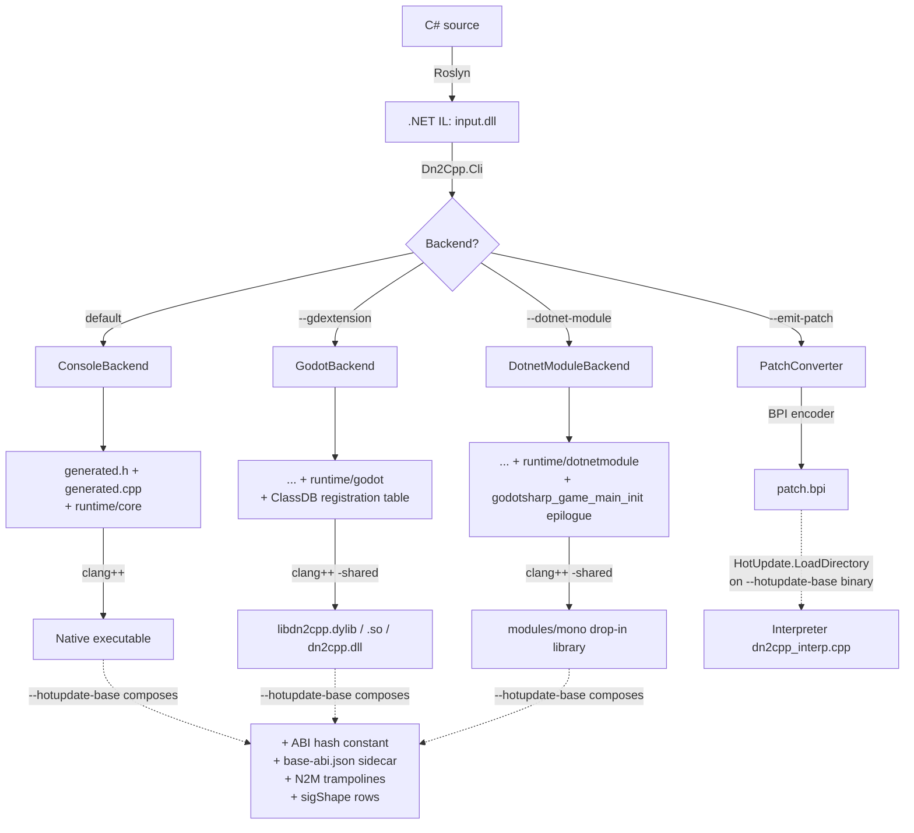

# dn2cpp

<p align="center">
  
</p>

> [!WARNING]
> **Pre-1.0.** dn2cpp is actively developed and not yet a stability
> promise for shipping products. APIs, CLI flags, generated C++, and the
> runtime ABI can change between commits without deprecation, and a
> handful of IL/BCL corners stay fenced (see Non-goals below).

**dn2cpp is an ahead-of-time compiler from .NET IL to C++, plus the C++
runtime it targets.** The core is pure .NET and knows nothing about any
game engine: it takes an IL assembly and produces a native executable —
`dotnet publish` a console app straight to a native binary, the same job
NativeAOT does, reached by a different route that goes through C++.

Godot's primary route is `--dotnet-module`: a stock `Godot.NET.Sdk`
project — the real `GodotSharp`, the real source generators,
`res://Player.cs` attached to a node in the scene — transpiles whole and
drops into the engine's `modules/mono` load path in place of the C# game,
the same move IL2CPP makes on Unity's mono. The [forked editor][fork]
packages that mono-module drop-in as a one-click export; it does not use
GDExtension. The separate `--gdextension` lane emits a library that a
stock engine with no .NET support can load. Godot is an output, not a
premise.

What goes in is real .NET IL — the actual `System.Private.CoreLib`, the
real `System.Linq`, the real `System.Text.Json` through source-gen — and
what comes out runs: full IL coverage, canonically shared generics
(IL2CPP-style, on by default), real OS threads, Boehm-GC-backed
finalizers and true `WeakReference`, and reflection at IL2CPP-level
parity. The transpiler **self-hosts**: a native `dn2cpp` re-transpiles
its own IL byte-identically — a fixpoint over tens of thousands of lines
of ordinary managed C#.

dn2cpp follows Unity IL2CPP's architecture: explicit vtables instead of
C++ `virtual`, canonically shared generic bodies, and a small runtime with
the BCL supplied as transpiled IL. It aims to bring that capability to
Godot and .NET at large, with full respect for IL2CPP's achievement.

[fork]: https://github.com/takuma-komatsu/godot-dn2cpp

## What you get

One core, four ways to ship it:

- **Console** — a native executable per platform, from any IL assembly.
- **Godot .NET (mono-module drop-in)** — the primary Godot lane, selected
  by `--dotnet-module`, for an existing `Godot.NET.Sdk` game. The built
  library lands where a NativeAOT export would, so the engine and export
  template stay stock and the source and scenes stay as they are. A
  [forked editor][fork] makes this flow one click.
  It indexes the engine's interop table by hard-coded position with no
  runtime handshake, so it is **4.7.2-stable or nothing** — see the ABI pin
  under Backends before shipping.
- **GDExtension** — a distinct lane that emits a shared library for a
  stock engine with no .NET support compiled in. It does not use the
  forked-editor export flow. The C# targets dn2cpp's generated GodotSharp
  shim, so an existing Godot .NET project has to be re-targeted.
- **Hot update (HybridCLR-style)** — a build-time-baked patch image run by
  a bytecode interpreter, so patches work where runtime code generation is
  prohibited (iOS, consoles).

Targets: **Windows, macOS, Linux, iOS (simulator), Android (NDK), WASM
(Emscripten)** — one PAL (`runtime/core/platform/`) and one CMake build
backend. macOS is the Tier-1 host; Windows and Linux run the full suite
green too, the Linux Godot lanes against a real engine included.

Everything is guarded by a regression suite (`./gates/run-all-gates.sh`)
that diffs native output against real .NET.

## For C# developers

**What dn2cpp reads is IL, so the C# language version is your SDK's
business, not dn2cpp's.** What it transpiles *alongside* your assembly is
always the real **.NET 10** `System.Private.CoreLib` and its
shared-framework closure — `--auto-ref` resolves that from the running
framework. Your project's own target framework is its own affair: the
Godot .NET samples under `samples/godot-dotnet/` are `net8.0` (what
`Godot.NET.Sdk` picks) and transpile against the net10 closure just the
same.

**What works out of the box.** The real CoreLib collections and strings,
LINQ, `System.Text.Json` through source-gen, `Regex` (both engines),
`System.IO.Compression`, `HttpClient` over HTTPS, file I/O, `decimal`, and
culture-aware numeric formatting. `async`/`await` on real state machines,
real OS threads and synchronization primitives, a real GC with finalizers
and true `WeakReference`, and reflection at Unity-IL2CPP parity. An
existing `Godot.NET.Sdk` project needs no source changes on the drop-in
lane.

**What does not, and will not.** Read these before you plan around them —
each is settled, and each refuses out loud rather than answering wrong:

- No `System.Reflection.Emit`, `dynamic`/DLR, or expression-tree
  `Compile()`: there is no JIT to emit into.
- `MakeGenericType`/`MakeGenericMethod` reach only instantiations already
  in the AOT image; anything else throws. The one carve-in: a generic
  definition the program typeofs whose bodies only ever `typeof(T)` ships
  a runtime-instantiation template, and `MakeGenericType` over it succeeds
  for any argument (asserted by `gates/build-and-run-reflect-types.sh`,
  section `ReflectRuntimeInstantiationSubset`).
- String comparison and collation are **ordinal only**, and named time
  zones, per-culture *date* formatting and localized display names are
  out (they need ICU + TZif). Culture-aware **numeric** formatting is in.
- 64-bit only. No COM interop.
- `FileStream.IsAsync` answers `false` — async file I/O runs the
  deterministic sync-over-async route.
- An unsupported IL or BCL shape is a transpile-time error or a catchable
  exception naming the type and the remedy, never a silently wrong answer.

**On the Web there is more:** no threads (`Task.Run`, `Thread` and `Timer`
throw), no HTTP transport (a browser has no socket layer), no real
`FileStream` (the intercepted `File.*` subset works on MEMFS), and the GC
is stop-the-world.

### Preserving code from stripping

dn2cpp recognizes Unity-compatible explicit preservation. Apply
`[Dn2Cpp.Scripting.Preserve]` to an assembly, type, constructor, method,
property, field, event, or delegate, or define your own attribute whose type or
base type has the exact simple name `PreserveAttribute`. The latter avoids a
managed dependency and is recognized regardless of namespace or assembly.

The built-in attribute is in `Dn2Cpp.Runtime.dll`. Reference the copy produced
by this checkout under `src/Dn2Cpp.Runtime/bin/<configuration>/<framework>/`,
or the copy under `bin/` in a dn2cpp toolchain or editor bundle. There is no
separate NuGet package for it.

From a repository checkout, add a project reference:

```xml
<ItemGroup>
  <ProjectReference Include="../dn2cpp/src/Dn2Cpp.Runtime/Dn2Cpp.Runtime.csproj" />
</ItemGroup>
```

For a toolchain or editor bundle, reference its existing assembly instead:

```xml
<ItemGroup>
  <Reference Include="Dn2Cpp.Runtime">
    <HintPath>path/to/Dn2Cpp/bin/Dn2Cpp.Runtime.dll</HintPath>
    <Private>false</Private>
  </Reference>
</ItemGroup>
```

Adjust the relative checkout path or bundle path to the project location. The
assembly contains no platform-specific managed code, so a project may compile
against either matching target-framework build.

Unity-format `link.xml` files are also supported. Pass a project directory with
the repeatable `--project-root <dir>` option; dn2cpp recursively finds files
named exactly `link.xml` anywhere below each root, excluding `bin`, `obj`,
`.godot`, and `.git` directories. `Dn2Cpp.Build` supplies the
MSBuild project directory automatically, and the forked editor supplies the C#
project directory during export. Direct CLI use without `--project-root` does
not search for XML files. A descriptor cannot add an assembly to the load set;
the assembly must already be the input, an explicit or automatic reference, or
a conditional default reference.

Descriptors guarded by `feature="com"`, `feature="sre"`, or
`feature="remoting"` apply only when the matching repeatable
`--link-feature <name>` option is present. The editor enables `com` for Windows
exports; all other feature values remain disabled unless explicitly requested.

The full list, with the reasoning, is under *Permanent non-goals* below.

## Quick start

### Prerequisites

- .NET SDK **net10.0** (`dotnet --list-sdks` should list a `10.0.x`)
- `clang++` (C++17) — or real MSVC `cl.exe` on Windows
- `cmake` ≥ **3.20** + `ninja`
- Godot **4.7** on `PATH` (or `GODOT=/path/to/godot`) — only for the
  Godot-lane gates
- `extension_api.json` at the repository root — generate on a fresh clone
  with `godot --headless --dump-extension-api`

These are the prerequisites of **this repository**, which builds through
the host's own tools. They are not the prerequisites of the distributable
editor: it carries a pinned cmake, ninja, node and Emscripten SDK of its
own and asks its user for none of them. The fork editor-export gates are
the one exception — they assert the export ran through the bundle's own
cmake and ninja, so unpack those (`gates/setup-buildtools.sh`) before
`gates/setup-godot-fork.sh` packages a bundle.

### Getting the tool

> **Not on nuget.org yet.** Publishing `dn2cpp` as a dotnet tool and
> `Dn2Cpp.Build` as an MSBuild package is planned, and the packaging is
> built and proven locally (`dist/nuget-smoke-test.sh` packs, installs
> from a local feed, transpiles, builds and diffs) — but neither package
> is on nuget.org today. Until they are, use a clone, or the [forked
> editor][fork]'s releases for one-click `--dotnet-module` Godot exports.

From a clone, the console lane end to end:

```bash
git clone https://github.com/takuma-komatsu/dn2cpp.git
cd dn2cpp
dotnet build src/Dn2Cpp.Cli -c Release

dotnet run --project src/Dn2Cpp.Cli -- MyApp.dll --auto-ref -o out
cmake -S runtime -B out/build -G Ninja \
      -DDN2CPP_APP_DIR="$PWD/out" -DDN2CPP_APP_NAME=MyApp
cmake --build out/build
./out/build/MyApp
```

`--auto-ref` with no `-r` defaults the CoreLib to the running shared
framework's copy and resolves the rest of the closure beside it.

Once published, the same thing without a checkout will read
`dotnet tool install -g dn2cpp`, then `dn2cpp MyApp.dll -o out --auto-ref`
with `cmake -S "$(dn2cpp --print-runtime-dir)"`; and `Dn2Cpp.Build`
(`src/Dn2Cpp.Build/`) will make `dotnet publish` do the whole thing in one
command.

### 60-second smoke test

```bash
godot --headless --dump-extension-api     # only on a fresh clone
./gates/build-and-run-sample.sh           # console: C# → IL → C++ → native → run
```

The script compiles `samples/dotnet/HelloWorld/`, transpiles it against
the tree-shaken real CoreLib, links it against the mini-runtime, and diffs
the output against `dotnet run` byte-for-byte.

The whole regression suite is `./gates/run-all-gates.sh` (`SKIP_GODOT=1`
for a fast pass without an engine, `JOBS=N` to cap parallelism). A gate
whose toolchain is missing skips and is reported separately from the
passes — a skip is never a pass. `AGENTS.md` is the authoritative contract
for the suite and the merge gate.

## Backends

### Console

- **What.** Emits `generated.{h,cpp[,cpp,...]}` (large bodies split across
  translation units for parallel compile) and links the `runtime/core/`
  TUs into a native executable.
- **Invoke.** `dotnet run --project src/Dn2Cpp.Cli -- <input.dll> -o <outdir>`
  (add `-r <ref.dll>` for extra assemblies, `--auto-ref` to pull the
  shared-framework closure).
- **GC mode.** Classic stop-the-world by default; override with
  `DN2CPP_GC_INCREMENTAL=1` / `DN2CPP_GC_TIME_LIMIT_MS`.

### Godot .NET — mono-module drop-in

The primary lane for an existing Godot C# game. **No GDExtension is
involved: the exported game uses the stock engine runtime and export
template; the fork changes editor tooling only.**

- **What.** A dn2cpp-built shared library substitutes for the C# game in
  Godot's `modules/mono` load path — it lands where a NativeAOT export
  would, so the engine picks it up through the `try_load_native_aot_library`
  path it already has. The real `GodotSharp.dll` is transpiled BCL-as-IL and
  every engine call goes through the `godotsharp_*` function-pointer array
  via `calli`, so no `extension_api.json` intrinsics are involved. Script
  semantics survive: `res://Player.cs` attached to a node resolves through
  the managed script bridge, so existing scenes bind as they are.
- **Invoke.** `dotnet run --project src/Dn2Cpp.Cli -- <input.dll> --dotnet-module -o <outdir>`.
  Runtime backend: `runtime/dotnetmodule/`, CMake `DN2CPP_DOTNET_MODULE`.
- **ABI pin — read this before shipping.** `godotengine/godot ed1daf0bf0`
  (4.7.2-stable). The emitted library indexes the interop table **by
  hard-coded position, with no runtime handshake**, so a mismatched engine
  build mis-dispatches silently rather than failing loudly. Two things hold
  it: the clone commit, in `gates/expected/godot-fork-pin.txt` and in each
  gate's own `PINNED_COMMIT`, and a SHA-256 tripwire over the interop array
  block and `ManagedCallbacks.cs`, frozen in
  `gates/expected/godot-dotnet-abi.sha256`; re-pin = re-run
  `gates/setup-godot-dotnet.sh` and re-freeze the fingerprint.
- **Editor integration.** A [forked Godot editor][fork] adds
  `dotnet/export_backend = dn2cpp` as an export option: one
  `--export-release` drives the `--dotnet-module` backend: it publishes
  the game IL, transpiles it, builds the C++ and stages the mono-module
  drop-in library. The fork's changes live in `GodotTools` (C#) and
  `build_assemblies.py`, never in the engine runtime or the ABI surfaces;
  design, fork strategy and re-pin procedure are in
  `docs/EDITOR-EXPORT-DESIGN.md`. Its Releases carry a macOS editor `.app`
  and a Windows `x86_64` editor, plus the export templates upstream cannot
  supply: Web, macOS `arm64`, and Windows `x86_64`. The Web and Windows template
  archives each contain distinct release and debug templates. The Windows pair
  carries the fork's native dependency search. The backend never cross-compiles,
  and upstream's macOS archive is universal-only. The
  `.app` is ad-hoc signed and not notarized, so clear its quarantine
  attribute (`xattr -dr com.apple.quarantine`) before the first launch; the
  Windows editor is unsigned, and building a **Windows game** from it needs
  the Visual Studio C++ workload *installed* — but no particular shell, as
  the editor locates MSVC itself. Web and Android need neither, each
  bringing its own compiler.
- **GC mode.** Supported native export targets show
  `dotnet/dn2cpp/incremental_gc` when the dn2cpp backend is selected. It defaults
  to incremental GC. At startup, `DN2CPP_GC_INCREMENTAL=0|1` overrides the
  exported default, and the Godot user argument
  `-- --dn2cpp-gc-incremental=0|1` overrides both. Web has no page-protection
  VDB, does not show the option, and always uses stop-the-world collection.
- **Verified.** In the real engine, end to end: all virtuals, input,
  `[Export]`, `[Signal]`, `ToSignal`, `RefCounted` lifetime stress, and
  **async interop** (`Task` continuations marshal back to the main thread
  via a non-blocking run-queue pump driven by the host frame callback). One
  headless export drives the fork pipeline to a playable macOS `.app`, an
  xcframework on an iPhone simulator, an APK the stock Android mono template
  loads, and a wasm side module in a real browser. Godot's upstream mono
  `squash_the_creeps` demo goes through this lane unmodified.
- **Carve-outs.** Editor F5 (export-run only; TOOLS builds use the hostfxr
  6-argument path), editor hot-reload state (`Callable` / delegate
  serialization reports "unserializable", which the engine already
  handles), GDScript→C# `CallStatic`, `Delegate.Method` (returns null),
  async void signal handlers, managed stack traces (an exception's
  `GD.PushError` text is real, but its file is null and line 0), and
  `Variant` → `GodotObject[]` conversion.

### GDExtension

The separate stock-engine lane. It runs on a Godot build with no .NET
support compiled in and is not part of the forked-editor flow. The C#
targets dn2cpp's generated GodotSharp shim rather than the real one, so an
existing Godot .NET project has to be re-targeted, and its classes
register in ClassDB as GDExtension classes rather than as C# scripts.

- **What.** Emits `libdn2cpp.dylib`/`libdn2cpp.so`/`dn2cpp.dll` that Godot
  loads at runtime, with transpiled C# registered in ClassDB. The name is
  fixed rather than derived from the app, so a shipped artifact carries no
  product name; `DN2CPP_APP_NAME` names only the CMake target here. On
  Windows it is spelled like the managed CLI assembly, which is a different
  file — the two never share a directory. Public C# static and instance
  methods and properties are callable from GDScript; **`Godot.Node`-derived
  C# classes are placeable in scenes** and receive engine virtual callbacks
  (`_Ready`, `_Process`, `_Notification`, and every `_*` whose signature the
  codec models — reverse-dispatch trampolines are generated per class from
  the API dump, not just the lifecycle/input set).
- **Invoke.** `dotnet run --project src/Dn2Cpp.Cli -- <input.dll> --gdextension -o <outdir>`,
  then compile as a shared library. Ship `dn2cpp.gdextension` next to it —
  copy `samples/godot/godot-project/dn2cpp.gdextension`, whose `[libraries]`
  already name the fixed library. Because both that name and `entry_symbol`
  are fixed, one project carries at most one dn2cpp GDExtension.
- **`Godot.NET.Sdk` source compatibility.** Standard-form C# using
  `Node2D`/`GD.Print`/`_Ready`/`[Export]`/`[Signal]`/`[Tool]` compiles
  against `src/GodotSharpShim/` (generated from `extension_api.json`) and
  transpiles unmodified — the *source* is portable, the project reference is
  not. All builtin value types round-trip; `Callable` (including
  delegate-backed), `Signal`, engine-backed
  `Godot.Collections.Array`/`Dictionary`, and typed arrays all cross the
  boundary.
- **`RefCounted`.** A strong/weak resurrection toggle keeps a C#-`new`
  registered `RefCounted` instance's state and virtual overrides alive
  across a hand-off to the engine (stored in an
  `Array`/`Dictionary`/property/scene/…) even after every C# reference is
  dropped; an overflow of the anchored-shim cap falls back to the plain
  detach path with a one-shot `stderr` warning.
- **GC mode.** Incremental Boehm (bounded frame pauses) by default;
  override with `DN2CPP_GC_INCREMENTAL` / `DN2CPP_GC_TIME_LIMIT_MS`.

### Hot update — Baked Patch Image (BPI)

- **What.** A HybridCLR-style AOT + interpreter hybrid. `--emit-patch`
  bakes a patch assembly at build time into a **BPI** — a compact
  register-based bytecode by default, or the stack encoding
  `--patch-stackcode` selects — that a base image built with
  `--hotupdate-base` loads at runtime and executes via
  `runtime/core/dn2cpp_interp.cpp`. Patches inherit from and override AOT
  types (dynamic vtable patch, N2M trampolines, patch-derived `Node`
  instances) **without any runtime code generation** — so it works on iOS
  and consoles.
- **Invoke** (base): `dn2cpp <input.dll> --hotupdate-base [--hotupdate-refs <roots.txt>]`.
  **Invoke** (patch): `dn2cpp --emit-patch <patch.dll> --base-abi <base-abi.json> [--patch-version N]`.
- **Deploy.** `Dn2Cpp.Runtime.HotUpdate.LoadDirectory("<dir>")` applies
  BPIs in `(patchVersion, filename)` order; header-stale BPIs are logged to
  stderr and skipped. Base-ABI drift is detected mechanically via
  `baseImageAbiHash` (FNV-1a over the symbolic contract in
  `docs/BPI-FORMAT.md`), so a stale patch is a loud diagnostic at load
  rather than a mis-bind.
- **Isolation.** Everything sits behind `--hotupdate-base` / `--emit-patch`
  / `runtime/core/dn2cpp_interp.cpp` (unlinked unless called). Normal builds
  are byte-identical.
- **Known limits.** Generic instantiations absent from the AOT image throw
  `NotSupportedException` unless pre-referenced (`hotupdate-refs.txt`,
  HybridCLR's `AOTGenericReferences` equivalent). Patch generic
  types/methods, filter clauses inside a patch, and value-type
  `Synchronized` methods stay fenced (loud bake-time rejection).

### Cross-platform (Windows / macOS / Linux / iOS / Android / WASM)

The core is platform-agnostic. Divergence is absorbed by a **Platform
Abstraction Layer** (`runtime/core/platform/`, the `dn2cpp_pal_*` seams)
with per-platform implementations (`posix/`, `wasm/`, `windows/`, plus a
complete portable-C++17 `reference/` implementation of the whole seam).
**CMake** (`runtime/CMakeLists.txt`, Ninja) is the sole build backend; the
gate scripts are thin wrappers. **`docs/PORTING.md` is the guide for
bringing dn2cpp up on a new target** — the seam inventory, the CMake edits,
the gate/skip protocol, and the recorded porting hazards.

The forked-editor route is the **mono-module drop-in** column;
GDExtension is the distinct stock non-.NET-engine lane.

| Platform | Console | Mono-module drop-in | GDExtension | Notes |
|----|:-:|:-:|:-:|----|
| **Windows** | ✅ | ✅ | ✅ | Win32 I/O, `_msize`, `localtime_s`, `\` and drive-letter rooted paths, real MSVC `cl.exe` (clang-cl not pursued) |
| **macOS** (Tier-1) | ✅ | ✅ E2E | ✅ | Full Boehm GC |
| **Linux** | ✅ | ✅ | ✅ | Shares the POSIX PAL with macOS; OpenSSL `CryptoNative_Evp*` crypto-digest PAL, membarrier, GC thread-deregistration. Full suite green, both Godot lanes against a real engine included |
| **iOS simulator** | ✅ | ✅ E2E | ✅ E2E | Full Boehm GC; `GD.Print` goes to the platform logger — use `Console` for E2E markers |
| **iOS device** | ⏳ | ⏳ | ⏳ | Provisioning required; the build path is verified headlessly |
| **Android** (NDK) | ✅ build | ✅ device | ✅ `.so` build | `arm64-v8a`, API 24; the drop-in cross-builds and runs on a Pixel 7a, including an unmodified C# demo exported by the forked editor onto the official mono template |
| **WASM** (Emscripten) | ✅ | ✅ browser | — | Full Boehm GC (Binaryen SpillPointers + a `dn2cpp_roots` section), MEMFS, single-threaded; P/Invoke against emcc-built static archives; the Godot drop-in exports to a real browser — where Godot 4 supports C# nowhere else |

## Architecture

The core (transpiler + runtime) knows nothing about Godot, dotnet-module
hosting, or hot update. Each delivery target is a layer that plugs in
through two hooks: `IEmitBackend` (tail-output) and `ICallIntrinsics`
(call-intrinsic).

| Layer | C# side | Native side |
|----|----|----|
| **Core (pure .NET)** | `src/Dn2Cpp.Transpiler/` — `Compilation` / `MethodCompiler` / `CppEmitter` / `PatchConverter`; `ConsoleBackend`. `src/Dn2Cpp.Runtime/` — always-referenced support assembly (`SZArrayEnumerable<T>`, `HotUpdate`, `NativeImplementation`) | `runtime/core/` — object model, strings, arrays, EH, GC integration; `runtime/core/intrinsics/`; `runtime/core/platform/` (PAL); optional SIMD (`runtime/core/dn2cpp_vectors.h`, `runtime/core/dn2cpp_vectors_hwy.h`) |
| **Godot .NET drop-in** | `src/Dn2Cpp.DotnetModule/` — `DotnetModuleBackend` (emits `godotsharp_game_main_init`) | `runtime/dotnetmodule/` |
| **GDExtension layer** | `src/Dn2Cpp.Godot/` — `GodotBackend`, `GodotCallIntrinsics`, `BindingGenerator` | `runtime/godot/` — table-driven bridge |
| **Hot update layer** | `PatchConverter` in `src/Dn2Cpp.Transpiler/` + `--hotupdate-base` output extras; `Dn2Cpp.Runtime.HotUpdate` public API | `runtime/core/dn2cpp_interp.cpp` — BPI loader/binder + register/stack interpreter, N2M trampolines |
| **CLI (composition root)** | `src/Dn2Cpp.Cli/` (output assembly `dn2cpp`) — arg parsing, backend selection; `src/Dn2Cpp.Cli.Console/` — Godot-free self-host trimmed CLI | — |
| **Reference-assembly shim** | `src/GodotSharpShim/` (builtin value types + `GD`/`Mathf`, generated from `extension_api.json`) | — |
| **Managed-swap backends** | `internal/DnZlib/` (pure-C# zlib), `internal/DnBrotli/` (pure-C# brotli), `internal/DnHttp/` (managed HTTP transport). All three are **conditional default references** — they ship beside the CLI and are injected only when the BCL assembly each one serves is in the load set; `-r` overrides, `--no-default-ref <Name>` declines | — |

The CLI selects the backend by flag: default → `ConsoleBackend`;
`--gdextension` → `GodotBackend`; `--dotnet-module` →
`DotnetModuleBackend`. `--hotupdate-base` composes with any of them (adds
an ABI-hash constant, a `base-abi.json` sidecar, N2M trampolines, and
`sigShape` rows); `--emit-patch <patch.dll>` short-circuits to
`PatchConverter.Run` (no C++ emission).



### Contract seams

- `IEmitBackend` (`src/Dn2Cpp.Transpiler/IEmitBackend.cs`) —
  `RuntimeHeader`, `CallIntrinsics`, `EmitEpilogue(...)`,
  `ShouldSkipMethodBody(ClassInfo, MethodInfo)`, `WantsSyntheticBody`,
  `HasPlaceholderBody`, `CalliAbiType`.
- `ICallIntrinsics` (`src/Dn2Cpp.Transpiler/ICallIntrinsics.cs`) —
  `TryEmitCall(mc, callee, isCallvirt)`, `TryEmitNewobj(mc, ctor)`.

`docs/ARCHITECTURE.md` covers the internals and the "how to add X"
recipes (a new IL opcode, a BCL intrinsic, an engine call, a new target
backend).

## Feature coverage

### Language & IL

Full ECMA-335 IL coverage. What that means concretely:

- **Types and dispatch** — classes, inheritance, static constructors with
  .NET first-use semantics, value types, enums, `record` classes (`with`,
  value equality), value tuples. **Virtual dispatch through explicit
  vtables** (IL2CPP-style, no C++ `virtual`) off the `Dn2CppTypeInfo` at
  the head of every object; interfaces use IL2CPP-style dispatch maps.
- **Memory and values** — arrays with bounds checks, multi-dimensional
  `T[,]`, element-size-generic backing so `T[]` works for any element
  type; **arrays as managed interfaces** (`T[]` as `IEnumerable<T>` /
  `IList<T>` / … via a per-`T` `SZArrayEnumerable<T>` wrapper);
  box/unbox and `is`/`as`/cast checks; `ref`/`out`/`in`; `constrained.`
  calls; checked arithmetic; `cpblk`/`initblk`; `typeof`/`ldtoken`.
- **UTF-16 strings** with .NET `System.String` semantics; UTF-8
  conversion happens only at the console / Godot / P/Invoke boundary.
- **Exception handling** — structural EH-region reconstruction into C++
  try/catch: multiple catch clauses, try/catch/finally, fault handlers,
  `catch … when` filters, multi-level finally chains, nested EH.
- **Delegates / lambdas** — `ldftn`/`ldvirtftn`, Roslyn display classes
  and cached lambdas, multicast `+=`/`-=`, static function pointers
  (`calli`/`delegate*<...>`).
- **Generics** — canonically shared bodies by default, in the IL2CPP
  manner; see *Optimization* below.
- **Static abstract interface members** — dispatched through `constrained.`,
  including a generic static abstract method on a generic interface and an
  implementation the interface carries itself.
- **`MethodImplOptions` honored** — `Synchronized` (RAII monitor guard,
  static sharing the monitor with `lock(typeof(X))`),
  `AggressiveInlining`, `NoInlining`.
- **Whole-program shaping** — reachability tree-shake from roots, so large
  assemblies import without transpiling unreached or unsupported code, and
  multi-assembly input (`-r`) resolving TypeRef/MemberRef across modules.

### BCL (System.*) over the real CoreLib

The real `System.Private.CoreLib.dll` goes in via `-r` (`--auto-ref`
pulls the shared-framework closure). The full CoreLib type graph loads,
tree-shaken to reachable methods, with real BCL IL bodies transpiled;
`Console`/`Math`/`String` prefer intrinsics.

| Area | State |
|---|---|
| Collections & strings | Real CoreLib `List<T>`/`Dictionary<K,V>`/`HashSet<T>`/`SortedDictionary`/`SortedSet`, `StringBuilder`, interpolated strings, the main `String` API, `Comparer<T>`/`EqualityComparer<T>.Default` |
| LINQ | Real `System.Linq.dll` transpiled as-is (SIMD paths folded to scalar) — no shim |
| JSON | Real `System.Text.Json` through the source-gen path (`[JsonSerializable]` + `JsonSerializerContext`); the generated `JsonTypeInfo<T>` and converters are real STJ IL |
| Iterators & async | Real CoreLib state machines; cooperative scheduler with real suspension, `Task.Yield`/`WhenAll`, the `ConfiguredValueTaskAwaitable(<T>)` awaiter family, `async IAsyncEnumerable<T>` |
| `decimal` | Intrinsic 96-bit value type — exact base-10 arithmetic (round-half-away), comparisons, conversions, `ToString`, the statics (`Round`/`Truncate`/`Floor`/`Ceiling`/`Parse`, …), LINQ `Sum`/`Average`, boxed virtuals |
| Culture & formatting | Culture-aware numeric/currency/percent/exponent formatting and `Parse`/`TryParse`, float shortest-round-trip, custom numeric formats; `CurrentCulture` follows the host locale through a PAL seam with no ICU dependency |
| Regex | Real `System.Text.RegularExpressions.dll`, both engines (backtracking interpreter and `NonBacktracking` symbolic DFA) |
| Compression | Full `System.IO.Compression` public surface — `DeflateStream`/`GZipStream`/`ZLibStream`, `BrotliStream`/`BrotliEncoder`/`BrotliDecoder`, `ZipArchive`/`ZipArchiveEntry`, `ZipFile`, and the net10 Zip async APIs |
| HTTP / HTTPS | `new HttpClient()` runs natively over vendored libcurl on vendored Mbed TLS, on by default; `https://` verifies against an embedded Mozilla CA bundle and nothing disables verification. HTTP/2 rides the same transport, and the real `Grpc.Net.Client` runs on top of it (unary and all three streaming shapes) |
| File I/O | Real `System.IO.File`/`FileStream` through the CoreLib's `libSystem.Native` P/Invoke layer against a self-implemented `SystemNative_*` PAL, directory enumeration included |
| Low-level interop | `Unsafe.*` (incl. `Unbox<T>`), `NativeMemory`, the `Marshal` heap/struct/string family, `Marshal.GetFunctionPointerForDelegate`/`GetDelegateForFunctionPointer`, `MemoryMarshal` span shaping, custom `MemoryManager<T>`-backed `Memory<T>` |

**Managed native-implementation substitution.** A
`[Dn2Cpp.Runtime.NativeImplementation(module, entryPoint)]` static method
in any referenced assembly replaces calls to the matching bodyless
`[DllImport]` at transpile time — the call site lowers to a direct managed
call and the native symbol is never linked. `internal/DnZlib/` and
`internal/DnBrotli/` use it to back all of `System.IO.Compression` with
pure C#, and because both are conditional default references, that is what
happens by default. The vendored native path is still there
(`runtime/core/intrinsics/dn2cpp_zlib_native.cpp` over `third_party/zlib/`,
the vendored brotli's own exports) and `--no-default-ref DnZlib` /
`--no-default-ref DnBrotli` is the way back to it.

### Real third-party libraries

Not shims, not ports. Each of these gates restores the library's own package
from nuget.org, pins the restored assembly by SHA-256, transpiles the IL the
library actually ships against the tree-shaken real CoreLib, and diffs the
native binary's stdout and exit code against `dotnet` running the same
assembly — with the transpile itself required to report zero gaps and zero
cuts, and both sides' stderr required to stay empty.

| Library | What its gate drives | Gate |
|---|---|---|
| MagicOnion.Client | Its source-generated NativeAOT client proxy first over a mock `CallInvoker`, then over a real `GrpcChannel`: a gate-only adapter carries the generated unary frame in a header so the YetAnotherHttpHandler HTTP/2 POST stays bodyless, while response unmarshalling, trailers and `UnaryResult` await cross the real transport | `gates/build-and-run-magiconion-client.sh`, `gates/build-and-run-magiconion-yetanotherhttphandler.sh` |
| MasterMemory | Source-generated typed tables over MessagePack data — database build/load, unique and non-unique indexes, composite indexes, exact/range/closest queries and forward/reverse views | `gates/build-and-run-mastermemory.sh` |
| MemoryPack | Source-generated formatters — object/struct/record, member ordering, `[MemoryPackConstructor]`, the serialization callbacks, unions over an interface and over an abstract base, version-tolerant and explicit layouts, the unmanaged whole-struct memcpy path, the `IBufferWriter` and `ReadOnlySequence` entry points | `gates/build-and-run-memorypack.sh` |
| MessagePack-CSharp | Source-generated indexed and map-keyed objects, ignored members and serialization constructors, collection formatters, interface unions, an AOT-safe composite resolver with a custom formatter, direct reader/writer use, `ReadOnlySequence` input and LZ4 block-array compression | `gates/build-and-run-messagepack.sh` |
| MessagePipe | In-memory, keyed, buffered and async pub/sub, request/response, request-all, global filter pipelines — resolved out of the real `Microsoft.Extensions.DependencyInjection` container | `gates/build-and-run-messagepipe.sh` |
| ZLinq | The zero-allocation LINQ pipeline: struct value-enumerator chains, aggregations, ordering, set operations, grouping and joining, materialization | `gates/build-and-run-zlinq.sh` |
| ZString | `Utf16ValueStringBuilder` and `Utf8ValueStringBuilder`, `ZString.Format`/`Concat`/`Join`, custom numeric formats | `gates/build-and-run-zstring.sh` |
| R3 | Subject subscriptions, `Where`/`Select`/`Scan`, resumable and terminal errors, `ReactiveProperty`, `Timer`, Channels-backed async enumeration | `gates/build-and-run-r3.sh` |
| UniTask | The tier-2 custom-async-task lane on the .NET build: adoption is declined automatically and the library's own combinators, scheduler and cancellation model transpile as real IL | `gates/build-and-run-unitask.sh` |
| GDTask | The same tier-2 lane inside the real Godot engine | `gates/build-and-run-gdtask.sh` |

A source generator's output is part of the subject, not a detail of the build:
MasterMemory's generated database, tables and resolver, MemoryPack's generated
formatters, and MessagePack-CSharp's generated resolver and formatters live in their
driver assemblies, so the transpiled IL is code no human wrote. Where a library
documents an AOT resolver route, the gate takes it:
MasterMemory composes its resolver with MessagePack's generated and builtin
resolvers, then passes the composite locally to database build and load. Where a
library's own design reaches for reflection
that no AOT target can serve — `MakeGenericType` plus `Activator` to mint a
formatter for a shape nothing named — the driver takes the library's documented
AOT route and registers the closed type instead; the gate says so at the call
site rather than hiding it.

### Runtime services

- **Boehm-Demers-Weiser GC** (vendored from Unity Technologies' fork under
  `third_party/bdwgc/`, compiled with the runtime, thread-aware).
  `ArrayPool<T>.Shared` is a real size-bucketed pool. Modes: classic
  stop-the-world (console default) and Boehm incremental (Godot default,
  bounded frame pauses), with `DN2CPP_GC_INCREMENTAL` /
  `DN2CPP_GC_TIME_LIMIT_MS` / `DN2CPP_GC_STATS` overrides. Godot exports also
  accept `--dn2cpp-gc-incremental=0|1` as a user argument, with argument over
  environment over exported-default precedence; `DN2CPP_NO_GC=1`
  opts out to a calloc fallback. `-DDN2CPP_GC_BACKEND=upstream` swaps in
  vendored upstream bdwgc (`third_party/bdwgc-upstream/`) instead of the
  fork — a dev-only cross-check, not shipped.
- **Finalizers** — `Finalize` overrides detected at build time and
  registered at allocation *before* the ctor runs, matching .NET's
  partially-constructed-object semantics; a dedicated finalizer thread
  drains the queue, and `GC.SuppressFinalize`/`ReRegisterForFinalize` do
  real (de)registration. **`WeakReference`/`WeakReference<T>`** are real,
  on Boehm disappearing and long links, with .NET resurrection semantics;
  **`GCHandle`** supports all four `GCHandleType` values.
- **Real OS threads** — `Thread`, `Task.Run`, `ThreadPool`,
  `Parallel.For`/`ForEach`/`Invoke` over `std::thread` and a real worker
  pool. **Real synchronization** — `Interlocked` → `__atomic_*`;
  `Monitor`/`lock` → per-object recursive mutexes; `Monitor.Wait`/`Pulse`,
  `SemaphoreSlim`, the event and countdown primitives,
  `ReaderWriterLockSlim`, `BlockingCollection<T>`, real `Timer`,
  `ThreadLocal<T>`/`[ThreadStatic]` → `thread_local`,
  `volatile`/`MemoryBarrier` → fences.
- **Reflection at Unity-IL2CPP parity** — the member-metadata APIs,
  `MethodInfo.Invoke`, `FieldInfo`/`PropertyInfo` get/set,
  `GetCustomAttributes`, `Type.GetType(string)`,
  `Activator.CreateInstance`, `MakeGenericType` over AOT-instantiated
  types (plus the typeof-only runtime-instantiation templates — see the
  boundary list above). `Type` objects are interned one per type-info handle, so
  `typeof(X)` and `GetType()` are reference-identical; retrieval is
  lock-free for statically-emitted types.
- **P/Invoke** — `DllImport` end to end: `string[]` write-back, delegates
  as native function pointers, non-blittable structs, blittable
  `[MarshalAs(ByValArray)]`. User imports bind lazily through
  `DllImportResolver` and the platform loader; `--direct-pinvoke` is the
  static-link opt-in. The supported marshalling surface is
  enumerated one feature per row in `docs/PINVOKE-MARSHALLING.md`.
- **Stack traces** — captured at throw and rendered against the reflection
  method tables; the opt-in `--shadow-stack` adds emitter-baked frame names
  that survive `-O2` inlining and exist on WASM, and makes the
  current-stack APIs real.

### Godot integration

The Godot lanes use different bridges (the full lane descriptions are
under *Backends* above):

- **Mono-module drop-in.** A real `Godot.NET.Sdk` game and the real
  `GodotSharp.dll` transpile together. Engine calls use the
  `godotsharp_*` function-pointer array through `calli`; the managed script
  bridge preserves existing C# script attachments. No
  `extension_api.json` intrinsics or GDExtension registration are involved.

- **GDExtension engine calls** go through a registry of method binds built
  from `extension_api.json` and a generic ptrcall path. All builtin value
  types round-trip; the shim lane reaches essentially the whole non-vararg
  instance-method surface plus the static and virtual populations — enums
  and bitfields, math PODs + RID, packed arrays ↔ managed arrays, a tagged
  `Variant`, engine-backed `Godot.Collections.Array`/`Dictionary` and typed
  arrays, `Callable` (including delegate-backed) and `Signal`, varargs and
  statics.
- **GDExtension scene-tree integration** — `Godot.Node`-derived C# classes are
  placeable in scenes and every `_*` virtual whose signature the codec
  models is overridable (reverse-dispatch trampolines generated per class),
  not just the lifecycle/input set. **`Godot.RefCounted`** lifetimes,
  including C#-`new`-created ones, survive engine hand-off.
- **GDExtension bindings generation** — `dn2cpp --generate-bindings extension_api.json`
  regenerates `src/GodotSharpShim/` and the transpiler's engine-call map
  from the same source of truth, implicitly inside every Godot-lane gate
  that exercises this bridge.
  Engine bindings are generated, never hand-listed: widening the supported
  marshalling shapes in `src/Dn2Cpp.Godot/GodotApi.cs` is how a filtered-out
  method starts working.

### Tooling

- **Self-hosting.** Both the Godot-free `src/Dn2Cpp.Cli.Console/` and the
  full CLI reach a **fixpoint**: the natively built dn2cpp re-transpiles
  its own source byte-identically (`gates/selfhost-emit.sh`,
  `gates/selfhost-emit-console.sh`) — a whole-program stress test of the
  core at real-application scale, with no .NET runtime dependency.
- **Gap-inventory measurement** (`--measure`) records a body's compile
  failure as a gap row instead of aborting the run, so it can drain a whole
  real-world assembly and report what would not emit.
- **Parallel transpilation** uses the host's logical processor count as its
  default concurrency ceiling and adapts worker fan-out to each batch of
  reachable method bodies, including `--measure`. Pass `--jobs <n>` to set an
  explicit ceiling, or `--jobs 1` for serial execution.

## Optimization

Each of these carries an opt-out, because the opt-out is what proves the
optimization changed no results. All are on by default except
`--trim-reflection`.

- **Canonically shared generics** (IL2CPP-style). Instantiations whose C++
  layout coincides collapse to placeholders: enum and sub-8-byte integer
  arguments to width-preserving placeholders, every reference argument to
  one `CnRef`. So `Dictionary<int,string>` and `Dictionary<SomeEnum,object>`
  share every non-ctor body, and generic *method* instantiations share too.
  Instantiation-dependent values (typeof, statics, `newarr`,
  `Comparer<T>.Default`) come from a per-instantiation RGCTX table, with a
  per-method monomorphic fallback for bodies that would bake exact identity.
  `--no-shared-generics` restores full monomorphization byte-identically.
- **Reachability tree-shake** from roots — an unreached method is never
  transpiled, which is what lets a large assembly import at all.
- **Translation-unit splitting** — generated C++ is cut into TUs the native
  build compiles in parallel.
- **Highway SIMD backend** (CMake `DN2CPP_USE_HIGHWAY`) behind the
  portable-SIMD surface; `-DDN2CPP_USE_HIGHWAY=OFF` returns to the scalar
  emulation, byte-identically in behavior. Platform-specific hardware
  intrinsics lower per family; see *Transient limitations*.
- **`--trim-reflection`** drops the member tables of types the program
  cannot plausibly reflect over (the Godot Web export turns it on). The
  analysis is unsound by nature, so a stripped type **throws** rather than
  answering empty, and `--reflection-root` is the escape hatch.
- **GC modes and unscanned allocation** — stop-the-world or incremental
  (bounded frame pauses); arrays with no reference fields allocate through
  the unscanned allocator, so the collector never traces them.
- **`MethodImplOptions` respected** — `AggressiveInlining` / `NoInlining`
  reach the generated C++.
- **The transpiler's own resource use is bounded.** Monomorphization is
  capped on nesting depth and on total count and fails loudly naming what
  drove it; emission streams its translation units to disk rather than
  holding the program's text; a specialization, a method signature or a
  field type nothing asks about is never decoded. `--max-heap-mb` is an
  opt-in managed-heap ceiling that fails naming the phase.

Planned: devirtualization and inlining hints, unused-method elimination
via ILLink integration, incremental transpilation (per-method differential
C++ generation), and `#line` debug info mapping generated C++ back to C#.

## Repository layout

| Path | Contents |
|------|----------|
| `src/Dn2Cpp.Transpiler/` | Core: `Compilation` / `MethodCompiler` / `CppEmitter` / `PatchConverter`; `ConsoleBackend` |
| `src/Dn2Cpp.DotnetModule/`, `src/Dn2Cpp.Godot/` | The two Godot backends (mono-module drop-in; GDExtension + engine-call intrinsics + `BindingGenerator`) |
| `src/Dn2Cpp.Cli/`, `src/Dn2Cpp.Cli.Console/` | CLI (output assembly `dn2cpp`) and the self-host trimmed CLI |
| `src/Dn2Cpp.Runtime/` | Always-referenced support: `SZArrayEnumerable<T>`, `HotUpdate`, the `NativeImplementation` attribute |
| `src/Dn2Cpp.Build/` | Targets-only MSBuild package — `dotnet publish` → native binary |
| `src/GodotSharpShim/` | "Fake GodotSharp" shim, generated from `extension_api.json` |
| `runtime/core/` | Object model, strings, arrays, exceptions, GC integration; `intrinsics/` (native intrinsic TUs); `platform/` (PAL: `posix/`, `wasm/`, `windows/`, `reference/`); `dn2cpp_interp.cpp` (hot-update loader + interpreter) |
| `runtime/godot/`, `runtime/dotnetmodule/` | Table-driven GDExtension bridge; `modules/mono` drop-in glue |
| `runtime/CMakeLists.txt` | Sole native build backend (Ninja); gates thin-wrap it |
| `internal/DnZlib/`, `internal/DnBrotli/`, `internal/DnHttp/` | Managed-swap libraries shipped as conditional default references |
| `third_party/` | Vendored: `bdwgc/`, `bdwgc-upstream/` (alternate GC source tree, `DN2CPP_GC_BACKEND=upstream`), `zlib/`, `brotli/`, `highway/`, `curl/`, `mbedtls/`, `nghttp2/`, `cacert/`, `gdextension_interface.h` (see License) |
| `samples/dotnet/` | Themed feature buckets — one `*.cs` per feature, driven by a themed gate |
| `samples/godot/`, `samples/godot-dotnet/`, `samples/native/` | GDExtension + Godot.NET.Sdk + hot-update projects; drop-in and editor-export projects; a small C library for P/Invoke testing |
| `gates/` | The regression suite (`build-and-run-*.sh`), `run-all-gates.sh` (parallel runner), `pre-merge.sh` (the merge gate), `_common.sh` (shared helpers) |
| `docs/` | `ARCHITECTURE.md` (internals), `STATUS.md` (open backlog), `BPI-FORMAT.md` (hot-update binary spec), `EDITOR-EXPORT-DESIGN.md`, `RELEASE.md` (cutting an editor release; `RELEASE.ja.md` translates it), `EDITOR-GUIDE.ja.md` (Japanese only — what a release's notes link for using the packaged editor), `PORTING.md`, `PINVOKE-MARSHALLING.md` |

## Design principles

- **IL2CPP-style "explicit vtable + C-style functions".** No C++
  `virtual`; dispatch goes through the vtable pointer in the object
  header. Generated code stays predictable, which eases GC / reflection /
  metadata integration.
- **The evaluation stack is modeled as single-assignment temporaries**,
  spilled to per-depth normalized variables at basic-block boundaries.
- **Deterministic generation** — the same input yields byte-identical
  output. Nothing in the environment may change what a successful
  transpile emits, which is what makes the self-host fixpoint checkable.
- **The runtime is a minimal object model + strings + arrays;** BCL
  semantics come from transpiling the real CoreLib. Intrinsics are a
  targeted optimization surface, not a semantics oracle.
- **Strings are UTF-16**; UTF-8 conversion happens only at the console /
  Godot / P/Invoke boundary.
- **A limit refuses out loud.** An unsupported shape is a transpile-time
  error or a catchable exception naming the type and the remedy — never a
  silently wrong answer.

## Non-goals & known issues

### Permanent non-goals

Boundaries dn2cpp shares with the IL2CPP family, plus a few forced by the
AOT model itself. These are settled, not deferred — each line says why, so
it does not come back as a ticket.

- **`System.Reflection.Emit` / runtime code generation / `dynamic` / DLR /
  expression tree `Compile`.** There is no JIT to emit into. Interpreting
  BPI bytecode does *not* fall under this — the interpreter never emits
  native code.
- **`MakeGenericType`/`MakeGenericMethod` over instantiations absent from
  the AOT image.** The instantiation does not exist in the binary and
  cannot be created; the call throws a catchable
  `PlatformNotSupportedException`. `System.Text.Json` avoids the boundary
  through source-gen; reflection-based `Deserialize<T>` stays carved out.
  The one class-side carve-in is the typeof-only runtime-instantiation
  template (a definition whose bodies never give a type argument value
  semantics — asserted by `gates/build-and-run-reflect-types.sh`, section
  `ReflectRuntimeInstantiationSubset`); everything else stays the boundary.
- **`__arglist` / `TypedReference`**, and varargs or HasThis function-pointer
  signatures. IL2CPP does not support them either.
- **`res://` / `user://` translation inside `System.IO` (Godot lane).**
  Convert first with `ProjectSettings.GlobalizePath(...)`, or take the
  writable root from `OS.GetUserDataDir()`. A transparent translation is
  not a missing feature but a trap: in an exported game `res://` lives
  inside the PCK where `open(2)` cannot reach it, so it would work in the
  editor and break in the shipped game.
- **COM interop / `BStr` / `SafeArray`** — they depend on the COM/OLE
  runtime and are not portably implementable. `ByValArray` (blittable
  elements) and `FunctionPtr` callbacks (including stored callbacks invoked from
  foreign native threads) *are* implemented; `ByValTStr` and `ByValArray` over
  non-blittable elements are not, and a `[MarshalAs]` the struct marshaller does not
  implement **refuses the crossing at transpile time**, naming the field.
  **Windows 32-bit P/Invoke ABI details** (stdcall decoration, 32-bit
  layout) go with it: dn2cpp is 64-bit-only.
- **Named/historical time zones, per-culture *date* formatting, and
  localized culture/time-zone names.** The real IL depends on ICU + TZif,
  and faithful name data is not one table but cultures × UI languages — a
  partial one would answer right in English and silently wrong in German.
  Culture-aware **numeric** formatting is fully supported and follows the
  host locale.
- **String comparison / collation is ordinal only.** No culture-sensitive
  comparison; `RegexOptions.Compiled` likewise degrades to the interpreter
  by design (same results, NativeAOT posture).
- **`Utf8JsonReader` over multi-segment `ReadOnlySequence<byte>`** (the
  rope/stream path). `Deserialize(string)`/`Deserialize(byte[])` take the
  single-segment fast path and never reach it.
- **`decimal`'s non-standard format specifiers and per-culture currency
  precision** go through `double` (15–17 digits).
- **Structural equality/hash is *synthesized* for a struct that overrides
  neither `Equals` nor `GetHashCode`** (`ValueType.Equals` is a QCall
  extern, so a field walk is the only road). The synthesis declines —
  loudly, at the use site — explicit layout (overlapping fields are a
  union a walk would double-count), `[InlineArray(N)]` and
  `[MarshalAs(ByValArray)]` fields, pointer / function-pointer /
  `TypedReference` fields, and a field typed `System.Enum`. A hot-update
  patch likewise cannot demand a *new* structural equality on a
  base-image struct: the bodies are minted at the base image's reach time,
  so an unmatched import fails loudly at load.
- **Canonical-shared static-virtual dispatch (generic math) has no rgctx
  slot mechanism.** A shared body whose `TSelf` resolves a static-virtual
  member expands per instantiation instead. Every unresolvable case is a
  loud transpile error, never a silent miscompile.
- **A spawned thread's post-`await` tail is not resumed once that thread
  exits.** Nothing pumps a dead thread's cooperative queue, and re-homing
  a half-suspended state machine would have to migrate its owner-only
  timer queue and virtual clock — exactly what makes single-threaded async
  deterministic and byte-identical.
- **Async file I/O runs sync-over-async.** `FileOptions.Asynchronous` is
  masked off every open, so `FileStream.IsAsync` answers `false`, and the
  base `Stream.ReadAsync`/`WriteAsync` slots dispatch through the
  subclass's own `Read`/`Write` and hand back a completed `Task` (only a
  subclass overriding *neither* async overload takes that path). There is
  no IOCP implementation and none is planned. Results are unaffected; what
  is lost is the *reported* asynchrony.
- **On WASM the filesystem is MEMFS, so files are ephemeral.**
  `FileStream` and the `File.*` surface work, but what a page writes lives
  in that page's memory and is gone when it unloads.
- **A user `[DllImport]` whose native side fills an `[Out] byte[]` with a
  syscall** would be unsafe under a collector that write-protects heap pages
  to recover dirty bits — a kernel store into such a page returns `EFAULT`
  rather than faulting into the GC's handler. The vendored fork's MANUAL_VDB
  build never does that, so managed arrays cross unpinned and uncopied by
  design; ask `dn2cpp_gc_kernel_write_unsafe(p)` and stage through your own
  buffer, as the PAL's own syscalls do, should that ever change.
- **Hand-written runtime types refuse `MemberwiseClone`** (`Thread`,
  `SemaphoreSlim`, `CountdownEvent`, `Barrier`, `ReaderWriterLockSlim`,
  `Timer`, `ManualResetEventSlim`, and `WaitHandle` with the event handles
  derived from it — `EventWaitHandle`, `ManualResetEvent`,
  `AutoResetEvent`): their C++ representation solely owns native state,
  so a bitwise copy would make two owners of one resource. The refusal
  is a catchable `PlatformNotSupportedException` naming the type.

### Transient limitations

These are open work, not boundaries — **`docs/STATUS.md` is the
authoritative list**. Representative examples as of now: the forked
editor's distributable `.app` is ad-hoc signed and not notarized. iOS
*device* execution is likewise unverified (provisioning required) — the
simulator lane is E2E-verified and the device build path is exercised
headlessly. The platform-specific `System.Runtime.Intrinsics` families
(`X86.*`, `Arm.*`, `Wasm.*`) form one capability contract: a family answers
`IsSupported` from the target's run-time CPU detection and required build
capabilities only once its whole instruction surface lowers, a promotion
`gates/build-and-run-platform-isa-surface.sh` decides from the generated
table `src/Dn2Cpp.Transpiler/CoreIntrinsics.PlatformIsa.g.cs`. Every other
family answers false, so the BCL software fallback runs, and calling one of
its instructions throws `PlatformNotSupportedException` exactly as .NET does
when `IsSupported` is false. Every family with feature bits lowers: the whole `X86.*` surface through
the AVX-512 and AVX10 families, the whole `Arm.*` surface, and
`Wasm.PackedSimd`; `Arm.Sve` and `Arm.Sve2`, experimental in .NET 10 and
without a fixed register width, have no feature bits and answer false by
design. On x86 the AVX, AVX-512 and AVX10 instruction bodies have run on no
supporting host yet (`docs/STATUS.md`). Like .NET 10, dn2cpp keeps `Avx10v2`
and the V512 `AvxVnniInt8` / `AvxVnniInt16` surface disabled until the positive
run-time opt-in `DN2CPP_ENABLE_AVX10V2=1`. AVX10.2 also uses a compiler-intrinsic
capability: a compiler without the checked spellings reports those families
false and compiles the same throwing stubs used on a foreign architecture.
`Wasm.PackedSimd` lowers, but a wasm module
either carries SIMD instructions or can load on an engine without them, so
it answers true only in a `DN2CPP_WASM_SIMD` (`-msimd128`) build; the default
console build and the Godot Web export stay non-SIMD and answer false, and
whether the export ever turns the axis on is a separate decision.
The opt-in only permits detected hardware; it cannot invent it.
`DN2CPP_CPU_FEATURES` then masks detection for tests
(`none`, `all`, a family list with what each family implies, `-Name` to
exclude) and never widens it;
`DN2CPP_CPU_FEATURES_DIAG=1` prints the detected, allowed and effective sets
once on stderr. Portable SIMD remains available through Highway.

### Runtime quirks

- **The first `godot --headless --import` may abort in editor doc-gen
  teardown** — a headless doc-gen bug on the Godot side.
  `extension_list.cfg` is already written before the abort, so execution
  is unaffected; the gates tolerate it with `|| true`.

## Roadmap

- **Publish the packages** — `dn2cpp` as a dotnet tool and `Dn2Cpp.Build`
  as an MSBuild package, so neither the tool nor a console publish needs a
  clone.
- **Notarize the distributable editor** — the packaged `.app` is ad-hoc
  signed today; notarizing it means auditing the hardened-runtime
  entitlements an editor needs to spawn a host `clang++` from outside the
  bundle and its own cmake, ninja, node and Emscripten clang from inside
  it.
- **Optimization** — the planned items are listed at the end of
  *Optimization* above.
- **2D game showcase** — prove the pipeline on a real game scene rather
  than on feature samples.
- **Cross-platform expansion** — extend the PAL + CMake foundation toward
  the remaining targets, reaching IL2CPP's original proposition: any IL to
  any platform, natively. (Console SDKs live behind NDAs and cannot be
  carried here; the PAL contract and a portable reference implementation
  are in-tree so a port needs no core changes.)

Open tickets: `docs/STATUS.md`.

## Contributing

External contributions are welcome — `CONTRIBUTING.md` is the guide. Read
`AGENTS.md` first (build, gates, module boundaries, code style) and the
*Permanent non-goals* above.

The full suite needs toolchains no contributor can be expected to have, so
the merge gate (`./gates/pre-merge.sh`) runs on a maintainer's machine and
not in CI. Before opening a PR, run the part that needs none of them:

```bash
./gates/build-and-run-sample.sh          # console: C# → IL → C++ → native
./gates/build-and-run-multiassembly.sh   # multi-assembly (-r)
SKIP_GODOT=1 ./gates/run-all-gates.sh    # the non-Godot suite
```

A failing gate is listed in `$LOGDIR/_failures.txt` with its log, a skipped
one in `$LOGDIR/_skips.txt` with its reason — **a skip is not a pass.**

### Pull request size

Large diffs — especially ones produced by vibe coding (AI-generated,
low-intent, sweeping changes) — are generally not accepted, due to
review cost and supply-chain-attack risk. If you want to send a large
change, please reach out beforehand to [@troubear](https://x.com/troubear).

Note that the maintainer isn't very comfortable in English, so
reaching out in Japanese is appreciated (English is fine too).

## License

dn2cpp is licensed under the [MIT License](LICENSE).

Vendored third-party components keep their own licenses:

- `third_party/bdwgc/` — Unity Technologies' bdwgc fork, permissive
  **bdw-gc** license
  ([provenance](third_party/bdwgc/DN2CPP-VENDORED.md),
  [`LICENSE`](third_party/bdwgc/LICENSE))
- `third_party/bdwgc-upstream/` — pre-fork upstream bdwgc 8.2.8,
  dev-only alternate backend, same permissive **bdw-gc** license
  ([provenance](third_party/bdwgc-upstream/DN2CPP-VENDORED.md),
  [`LICENSE`](third_party/bdwgc-upstream/LICENSE))
- `third_party/zlib/` — classic zlib 1.3.2, **zlib** license
  ([`third_party/zlib/LICENSE`](third_party/zlib/LICENSE))
- `third_party/brotli/` — google/brotli 1.1.0, **MIT**
  ([`third_party/brotli/LICENSE`](third_party/brotli/LICENSE))
- `third_party/highway/` — Google Highway 1.4.0, **Apache License 2.0 /
  BSD 3-Clause**
  ([`third_party/highway/LICENSE`](third_party/highway/LICENSE))
- `third_party/curl/` — curl 8.21.0, the permissive **curl** license (an
  MIT/X derivative)
  ([`third_party/curl/COPYING`](third_party/curl/COPYING))
- `third_party/mbedtls/` — Mbed TLS 3.6.7, dual **Apache-2.0 OR
  GPL-2.0-or-later**; dn2cpp elects **Apache-2.0**, because a GPL election
  would change the license of everything a dn2cpp-built binary links
  ([`third_party/mbedtls/LICENSE`](third_party/mbedtls/LICENSE) carries both
  texts)
- `third_party/nghttp2/` — nghttp2 1.70.0, **MIT**
  ([`third_party/nghttp2/COPYING`](third_party/nghttp2/COPYING))
- `third_party/cacert/` — the Mozilla CA bundle as curl distributes it,
  **MPL-2.0** — the one non-permissive license here. `cacert.pem` carries
  provenance but no license text, so this line is the record
- `third_party/gdextension_interface.h` — Godot GDExtension header,
  **MIT** (license text embedded in the file header)

The managed-swap libraries under `internal/` each take the licence its
upstream forces, which is not one licence for all three:

- `internal/DnZlib/` — a pure-C# zlib ported from zlib 1.3.2, so it ships
  under the **zlib License**, its upstream's own terms, and carries
  zlib-ng / fast_zlib notices besides
  ([`internal/DnZlib/LICENSE`](internal/DnZlib/LICENSE),
  [`internal/DnZlib/THIRD-PARTY-NOTICES.txt`](internal/DnZlib/THIRD-PARTY-NOTICES.txt))
- `internal/DnBrotli/` — a pure-C# brotli ported from google/brotli 1.1.0,
  whose upstream is MIT, so it ships under **MIT**
  ([`internal/DnBrotli/LICENSE`](internal/DnBrotli/LICENSE))
- `internal/DnHttp/` — original dn2cpp code (a managed transport swap for
  `System.Net.Http`), ported from nothing, so it carries no upstream notices
  and ships under **MIT** like dn2cpp itself
  ([`internal/DnHttp/LICENSE`](internal/DnHttp/LICENSE))

All three ship in the NuGet tool and the toolchain bundle, beside the CLI —
they are conditional default references, not optional extras.
